# Data_LG — 자연어 기반 회귀 분석 플랫폼

자연어 메시지만으로 데이터 프로파일링 → EDA → 모델링 → 최적화까지 수행하는 멀티턴 분석 플랫폼입니다.  
LangGraph 워크플로우 엔진이 사용자 의도를 자동으로 분류해 적절한 분석 서브그래프로 라우팅합니다.

---

## 시작하기

### 설치

```bash
bash install.sh
```

vLLM 엔드포인트·모델명을 대화형으로 입력합니다. 이후:
- Python 의존성 설치 (`uv sync`)
- DB 마이그레이션 (`alembic upgrade head`)
- 시드 데이터 입력 (admin / demo 계정)
- npm 패키지 설치

### 실행

```bash
bash run.sh
```

| 서비스 | 주소 |
|--------|------|
| 프론트엔드 | http://localhost:3000 |
| 백엔드 API | http://localhost:8000/docs |

### 기본 계정

| 역할 | 아이디 | 비밀번호 |
|------|--------|----------|
| 관리자 | `admin` | `Admin123!` |
| 데모 | `demo_user_1` | `Demo123!` |

---

## 전체 시스템 아키텍처

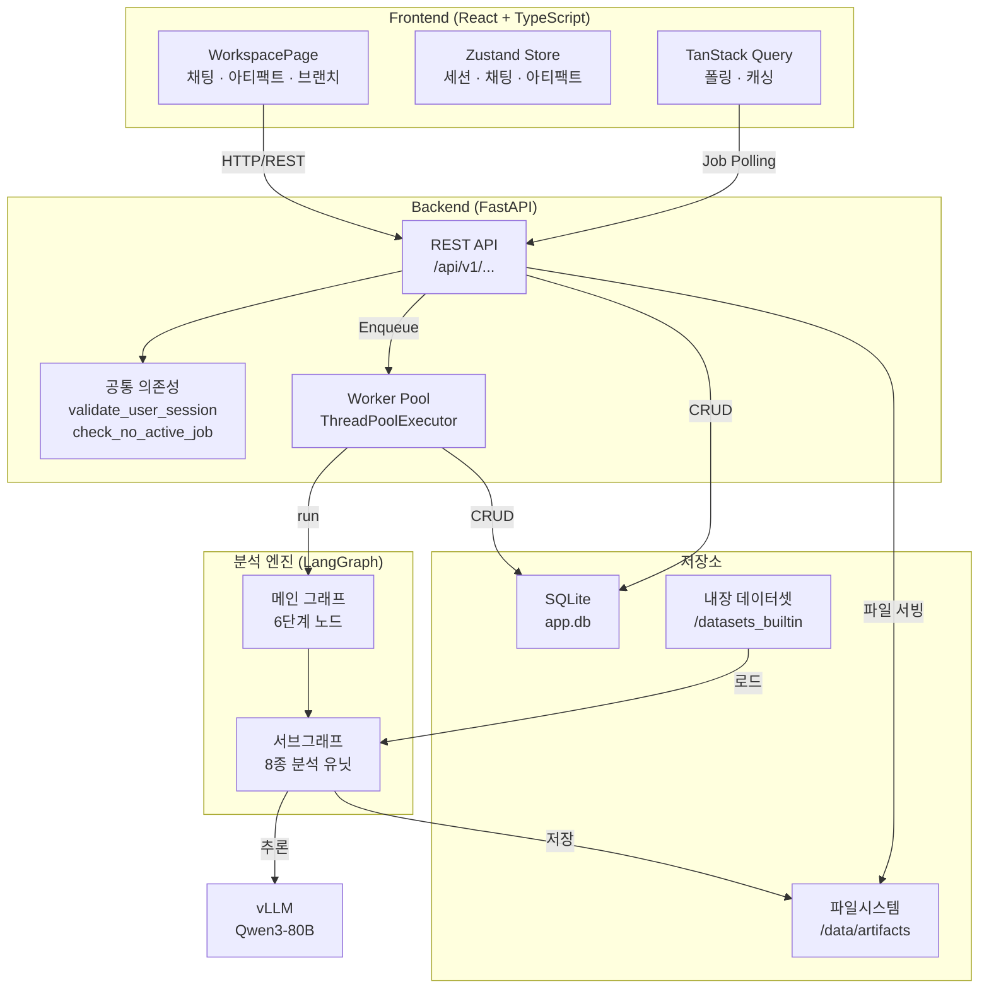

---

## 분석 파이프라인 (LangGraph 메인 그래프)

사용자 메시지가 들어오면 6단계 노드를 순차 처리합니다.

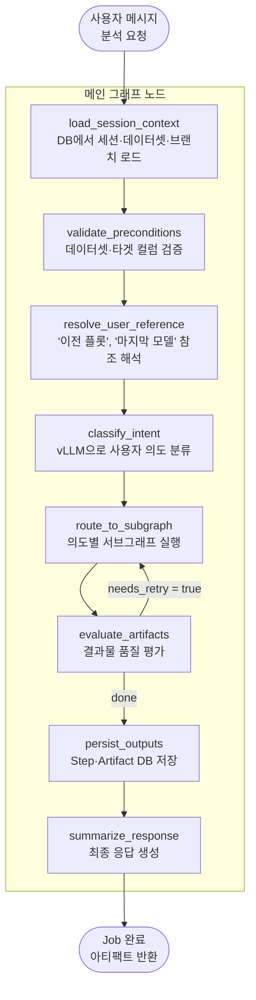

---

## 인텐트 분류 및 라우팅

`classify_intent` 노드가 사용자 메시지를 분석해 아래 8종 서브그래프 중 하나로 라우팅합니다.

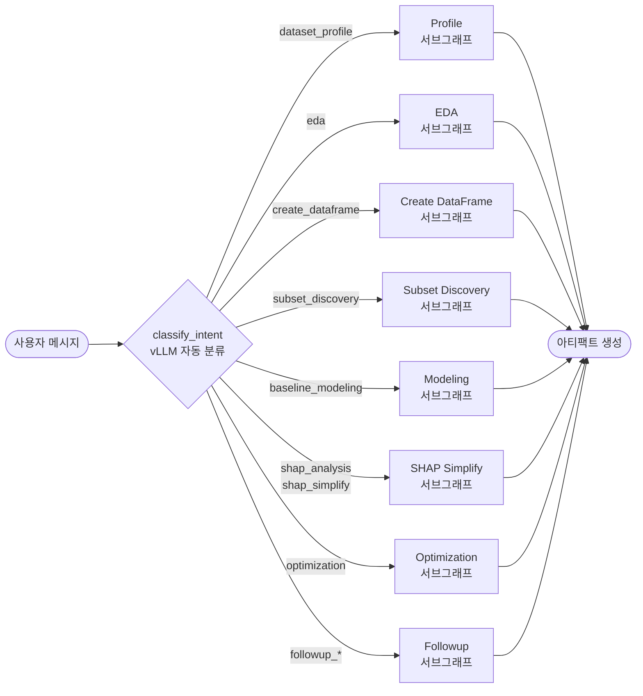

---

## 서브그래프 상세 파이프라인

### Profile

데이터셋의 스키마·결측·타겟 후보를 자동으로 분석합니다.

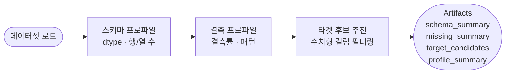

### EDA

자연어 요청을 받아 시각화 코드를 자동 생성·실행합니다.

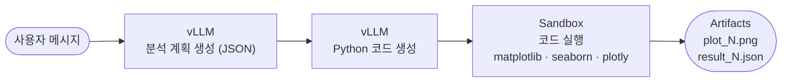

### Create DataFrame

필터·변환 조건을 코드로 생성해 서브 데이터프레임을 만듭니다.

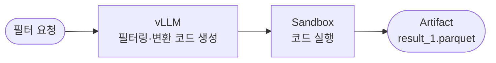

### Subset Discovery

결측 구조 분석으로 분석 가능한 밀집 서브셋을 탐색합니다.

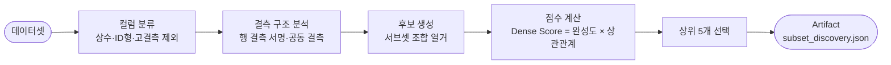

### Modeling (LightGBM)

LightGBM 기반 회귀 모델을 학습하고 챔피언을 선정합니다.

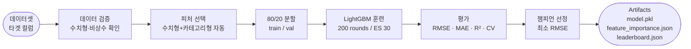

### SHAP Simplify

SHAP 값으로 피처를 해석하고 단순화된 모델을 생성합니다.

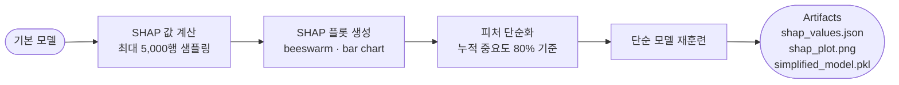

### Optimization

탐색 공간 크기에 따라 Grid Search 또는 Optuna를 자동 선택합니다.

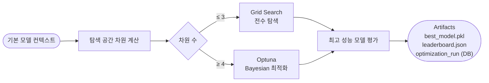

---

## 작업(Job) 생명주기

API 요청부터 결과 반환까지의 비동기 작업 흐름입니다.

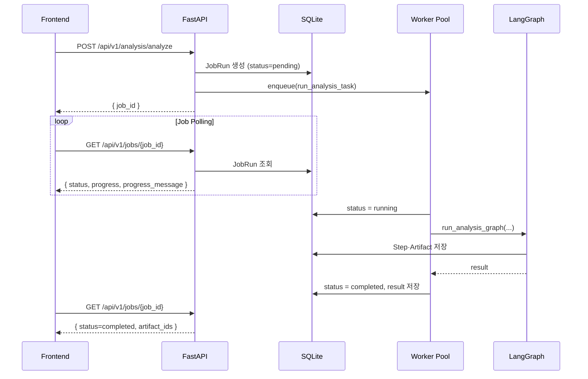

---

## 데이터 모델 (ER 다이어그램)

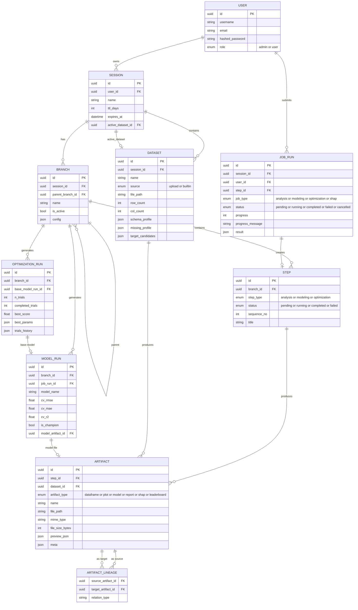

---

## API 엔드포인트 목록

| 그룹 | 메서드 | 경로 | 설명 |
|------|--------|------|------|
| **Auth** | POST | `/api/v1/auth/login` | 로그인 |
| | GET | `/api/v1/auth/me` | 내 정보 조회 |
| | POST | `/api/v1/auth/logout` | 로그아웃 |
| **Sessions** | POST | `/api/v1/sessions` | 세션 생성 |
| | GET | `/api/v1/sessions` | 세션 목록 |
| | GET | `/api/v1/sessions/{id}` | 세션 상세 |
| | PATCH | `/api/v1/sessions/{id}` | 세션 수정 |
| | DELETE | `/api/v1/sessions/{id}` | 세션 삭제 |
| **Datasets** | POST | `/api/v1/sessions/{id}/datasets/upload` | 파일 업로드 |
| | POST | `/api/v1/sessions/{id}/datasets/builtin` | 내장 데이터셋 선택 |
| | GET | `/api/v1/sessions/{id}/datasets/builtin-list` | 내장 데이터셋 목록 |
| | GET | `/api/v1/sessions/{id}/datasets` | 데이터셋 목록 |
| | GET | `/api/v1/sessions/{id}/datasets/{did}/preview` | 미리보기 |
| | GET | `/api/v1/sessions/{id}/datasets/{did}/target-candidates` | 타겟 후보 |
| **Analysis** | POST | `/api/v1/analysis/analyze` | 자연어 분석 요청 |
| | POST | `/api/v1/analysis/dataframe-followup` | 데이터프레임 후속 분석 |
| | POST | `/api/v1/analysis/plot-followup` | 플롯 후속 분석 |
| **Modeling** | POST | `/api/v1/modeling/baseline` | 기본 모델 훈련 |
| | POST | `/api/v1/modeling/shap` | SHAP 분석 |
| **Optimization** | POST | `/api/v1/optimization/run` | 하이퍼파라미터 최적화 |
| | POST | `/api/v1/optimization/inverse` | 역최적화 |
| **Jobs** | GET | `/api/v1/jobs/{job_id}` | 작업 상태 조회 |
| | POST | `/api/v1/jobs/{job_id}/cancel` | 작업 취소 |
| | GET | `/api/v1/jobs/session/{sid}/active` | 활성 작업 조회 |
| **Artifacts** | GET | `/api/v1/sessions/{id}/artifacts/{aid}` | 아티팩트 조회 |
| | GET | `/api/v1/sessions/{id}/artifacts/{aid}/download` | 다운로드 |
| | DELETE | `/api/v1/sessions/{id}/artifacts/{aid}` | 삭제 |
| **Branches** | POST | `/api/v1/sessions/{id}/branches` | 브랜치 생성 |
| | GET | `/api/v1/sessions/{id}/branches` | 브랜치 목록 |
| | PATCH | `/api/v1/sessions/{id}/branches/{bid}` | 브랜치 수정 |
| **Steps** | GET | `/api/v1/sessions/{id}/steps` | 스텝 목록 |
| | GET | `/api/v1/sessions/{id}/steps/{sid}` | 스텝 상세 |

---

## 프론트엔드 구조

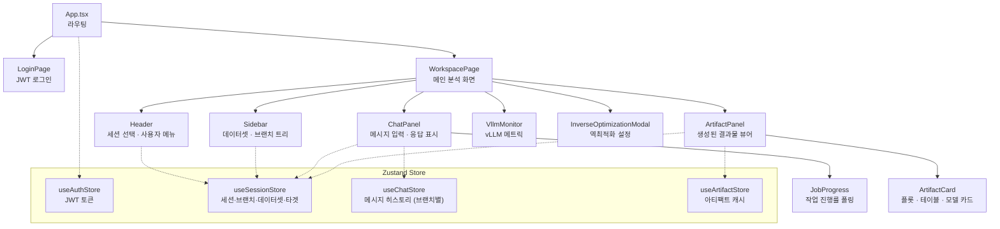

---

## 내장 데이터셋

| 키 | 용도 | 크기 |
|----|------|------|
| `general_tabular_regression` | 일반 회귀 기본 데모 | 813 KB |
| `instrument_measurement` | 계측·센서 시계열 데이터 | 2.4 MB |
| `manufacturing_regression` | 제조 공정 산업 시나리오 | 4.3 MB |
| `large_sampling_regression` | 대용량 성능 테스트 | 34 MB |

---

## 기술 스택

| 영역 | 기술 |
|------|------|
| **프론트엔드** | React 18, TypeScript, Vite, Tailwind CSS, TanStack Query, Zustand |
| **백엔드** | FastAPI, SQLAlchemy 2 (async), Alembic, Pydantic v2 |
| **AI 엔진** | LangGraph, LangChain-OpenAI, vLLM (Qwen3-80B) |
| **ML** | LightGBM, XGBoost, CatBoost, scikit-learn, SHAP, Optuna |
| **데이터** | Pandas, PyArrow, Plotly, Matplotlib, Seaborn |
| **DB** | SQLite (aiosqlite, async) |
| **패키지 관리** | uv (Python), npm (Node) |

---

## 환경 설정

`.env.simple`을 복사해 `.env`로 사용합니다.

```bash
# vLLM 추론 엔드포인트
VLLM_ENDPOINT_SMALL=http://your-vllm-server/v1
VLLM_MODEL_SMALL=Qwen3/Qwen3-Next-80B-A3B-Instruct-FP8
VLLM_TEMPERATURE=0.1
VLLM_MAX_TOKENS=4096

# 파일 저장 경로
ARTIFACT_STORE_ROOT=./data/artifacts
BUILTIN_DATASET_PATH=./datasets_builtin

# 앱 설정
APP_ENV=development
MAX_UPLOAD_MB=100
MAX_SHAP_ROWS=5000
JOB_TIMEOUT_SECONDS=600
DEFAULT_SESSION_TTL_DAYS=7
```

---

## 디렉토리 구조

```
Data_LG/
├── backend/
│   ├── app/
│   │   ├── api/v1/routes/     # REST API 엔드포인트 (11개)
│   │   ├── core/              # 설정·로깅
│   │   ├── db/
│   │   │   ├── models/        # SQLAlchemy 모델 (12개)
│   │   │   └── repositories/  # DB 접근 레이어 (9개)
│   │   ├── graph/
│   │   │   ├── nodes/         # LangGraph 노드 (6개)
│   │   │   └── subgraphs/     # 분석 서브그래프 (8개)
│   │   ├── schemas/           # Pydantic 요청/응답 스키마
│   │   ├── services/          # 비즈니스 로직 (8개)
│   │   └── worker/            # 비동기 작업 워커
│   ├── tests/                 # pytest 통합·유닛 테스트
│   └── alembic/               # DB 마이그레이션
├── frontend-react/
│   └── src/
│       ├── pages/             # LoginPage, WorkspacePage
│       ├── components/        # UI 컴포넌트
│       ├── store/             # Zustand 스토어
│       ├── api/               # API 클라이언트
│       └── types/             # TypeScript 타입
├── datasets_builtin/          # 내장 parquet 데이터셋
├── install.sh                 # 최초 설치 스크립트
├── run.sh                     # 서비스 실행 스크립트
└── .env.simple                # 환경 설정 템플릿
```
