# 회귀 분석 플랫폼

vLLM + LangGraph 기반 멀티턴 Tabular 회귀 분석 플랫폼

---

## 목차

1. [시스템 개요](#1-시스템-개요)
2. [디렉터리 구조](#2-디렉터리-구조)
3. [아키텍처 전체 구성도](#3-아키텍처-전체-구성도)
4. [데이터 파이프라인](#4-데이터-파이프라인)
5. [LangGraph 워크플로우](#5-langgraph-워크플로우)
6. [API 구조](#6-api-구조)
7. [데이터베이스 스키마](#7-데이터베이스-스키마)
8. [Frontend 구조](#8-frontend-구조)
9. [설치 및 실행](#9-설치-및-실행)
10. [환경 변수](#10-환경-변수)

---

## 1. 시스템 개요

사용자가 CSV/Parquet 파일을 업로드하거나 내장 데이터셋을 선택해 세션을 생성하고,  
**EDA → Dense Subset Discovery → LightGBM Baseline → SHAP 분석 → Optuna 역최적화**까지의  
전체 회귀 분석 파이프라인을 **멀티턴 채팅**으로 수행할 수 있는 시스템입니다.

### 기술 스택

| 계층 | 기술 |
|------|------|
| Frontend | Streamlit (실시간 폴링, vLLM 모니터) |
| Backend | FastAPI + Uvicorn |
| Workflow Engine | LangGraph (DAG 기반 분석 파이프라인) |
| LLM | vLLM (외부 엔드포인트, OpenAI 호환) |
| 코드 실행 | Subprocess Sandbox + PandasAI |
| DB | SQLite + SQLAlchemy (동기/비동기) |
| 작업 큐 | ThreadPoolExecutor (인메모리 큐) |
| Artifact Store | 로컬 파일시스템 (Parquet, PNG, PKL) |
| 패키지 관리 | uv (pip 대체) |
| ML 라이브러리 | LightGBM, SHAP, Optuna, scikit-learn |

---

## 2. 디렉터리 구조

```
Data_LG/
├── backend/                        # FastAPI 백엔드
│   ├── app/
│   │   ├── main.py                 # FastAPI 앱 진입점 (lifespan, CORS, 라우터 등록)
│   │   ├── api/
│   │   │   ├── deps.py             # 의존성 주입 (현재 사용자, DB 세션)
│   │   │   └── v1/
│   │   │       ├── router.py       # v1 라우터 통합
│   │   │       └── routes/
│   │   │           ├── auth.py          # 로그인, 토큰 갱신
│   │   │           ├── sessions.py      # 세션 CRUD
│   │   │           ├── datasets.py      # 데이터셋 업로드/선택
│   │   │           ├── branches.py      # 분석 브랜치 관리
│   │   │           ├── steps.py         # 분석 스텝 조회
│   │   │           ├── artifacts.py     # 아티팩트 조회/다운로드
│   │   │           ├── analysis.py      # 자연어 분석 요청 (핵심)
│   │   │           ├── modeling.py      # 모델링 작업
│   │   │           ├── optimization.py  # 최적화 작업
│   │   │           ├── jobs.py          # 작업 상태/취소
│   │   │           └── admin.py         # 헬스체크, 설정
│   │   ├── core/
│   │   │   ├── config.py           # Settings (vLLM, SQLite, JWT, 경로)
│   │   │   ├── security.py         # JWT 토큰 생성/검증
│   │   │   └── logging.py          # structlog 설정
│   │   ├── db/
│   │   │   ├── base.py             # SQLAlchemy Base, BaseModel
│   │   │   ├── models/             # ORM 엔티티
│   │   │   │   ├── user.py         # User, UserRole
│   │   │   │   ├── session.py      # Session (분석 세션)
│   │   │   │   ├── dataset.py      # Dataset (업로드/내장)
│   │   │   │   ├── branch.py       # Branch (분석 변형)
│   │   │   │   ├── step.py         # Step (분석 단계)
│   │   │   │   ├── artifact.py     # Artifact + ArtifactLineage
│   │   │   │   ├── job.py          # JobRun (비동기 작업)
│   │   │   │   ├── model_run.py    # ModelRun (LightGBM 학습)
│   │   │   │   └── optimization.py # OptimizationRun (Optuna)
│   │   │   ├── repositories/       # Repository 패턴 (CRUD)
│   │   │   └── seed.py             # 초기 계정 + 내장 데이터셋 등록
│   │   ├── graph/                  # LangGraph 분석 엔진
│   │   │   ├── main.py             # 그래프 빌더 + 실행기
│   │   │   ├── state.py            # GraphState (TypedDict)
│   │   │   ├── llm_client.py       # vLLM 클라이언트 (OpenAI 호환)
│   │   │   ├── sandbox.py          # 코드 안전 실행 (subprocess)
│   │   │   ├── pandasai_runner.py  # PandasAI 실행기
│   │   │   ├── helpers.py          # DB 헬퍼, 진행률, 아티팩트 저장
│   │   │   ├── learning.py         # 학습 메모리 (사용자 선호도)
│   │   │   ├── nodes/
│   │   │   │   ├── load_context.py       # 세션/데이터셋/브랜치 로드
│   │   │   │   ├── validate.py           # 전제 조건 검증
│   │   │   │   ├── resolve_reference.py  # 사용자 참조 해석
│   │   │   │   ├── classify_intent.py    # vLLM 인텐트 분류
│   │   │   │   ├── evaluate.py           # 결과 평가 + 재시도 판단
│   │   │   │   ├── persist.py            # DB/파일 저장
│   │   │   │   └── summarize.py          # 최종 응답 생성
│   │   │   └── subgraphs/
│   │   │       ├── profile.py            # 데이터셋 프로파일 (ydata)
│   │   │       ├── eda.py                # EDA (통계, 분포, 상관관계)
│   │   │       ├── create_dataframe.py   # 새 DataFrame 생성
│   │   │       ├── subset_discovery.py   # Dense Subset 발견
│   │   │       ├── modeling.py           # LightGBM Baseline Modeling
│   │   │       ├── shap_simplify.py      # SHAP + 모델 단순화
│   │   │       ├── optimization.py       # Optuna HPO
│   │   │       └── followup.py           # 후속 질문 처리
│   │   ├── services/
│   │   │   ├── artifact_store.py   # 파일시스템 Artifact 저장/조회
│   │   │   ├── artifact_service.py # Artifact 메타데이터 관리
│   │   │   ├── dataset_service.py  # 데이터셋 검증/처리
│   │   │   ├── session_service.py  # 세션 관리 + TTL
│   │   │   ├── preview_builder.py  # Artifact 미리보기 생성
│   │   │   ├── lineage_service.py  # 아티팩트 계보 추적
│   │   │   └── builtin_registry.py # 내장 데이터셋 레지스트리
│   │   ├── schemas/                # Pydantic 요청/응답 스키마
│   │   └── worker/
│   │       ├── queue.py            # ThreadPoolExecutor 작업 큐
│   │       ├── tasks.py            # run_analysis_task() 진입점
│   │       ├── job_runner.py       # DB 상태 동기 업데이트
│   │       ├── progress.py         # 진행률 관리
│   │       ├── cancellation.py     # 작업 취소 신호
│   │       └── inverse_optimize_tasks.py # 역최적화 작업
│   ├── alembic/                    # DB 마이그레이션
│   ├── tests/                      # pytest 테스트
│   ├── data/
│   │   ├── app.db                  # SQLite 데이터베이스
│   │   └── artifacts/              # Artifact 파일 저장소
│   └── pyproject.toml
│
├── frontend/
│   ├── app/
│   │   └── main.py                 # Streamlit 단일 앱 (~1,800줄)
│   └── pyproject.toml
│
├── datasets_builtin/               # 내장 데이터셋
│   ├── generate_datasets.py
│   └── *.parquet
│
├── .env                            # 환경 변수
├── .env.example                    # 환경 변수 예시
├── docker_install.sh               # Docker 내 자동 설치 스크립트
├── one-shot.sh                     # 원샷 설치/실행 스크립트 (root)
└── start.sh                        # 서비스 시작 스크립트
```

---

## 3. 아키텍처 전체 구성도

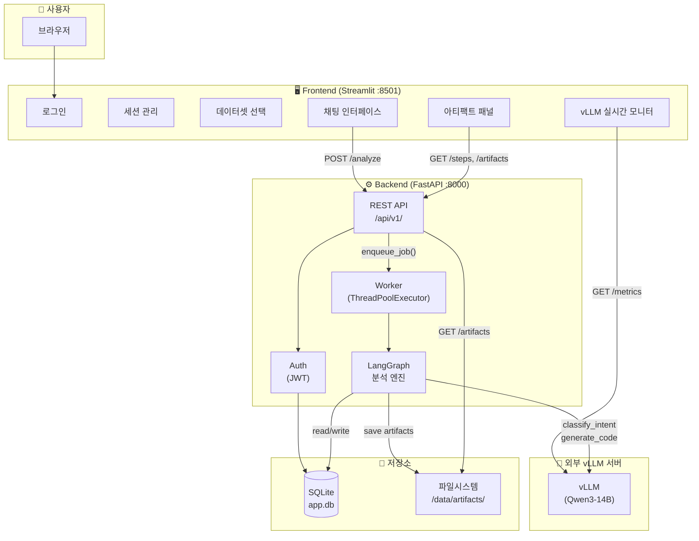

---

## 4. 데이터 파이프라인

### 4.1 전체 데이터 흐름

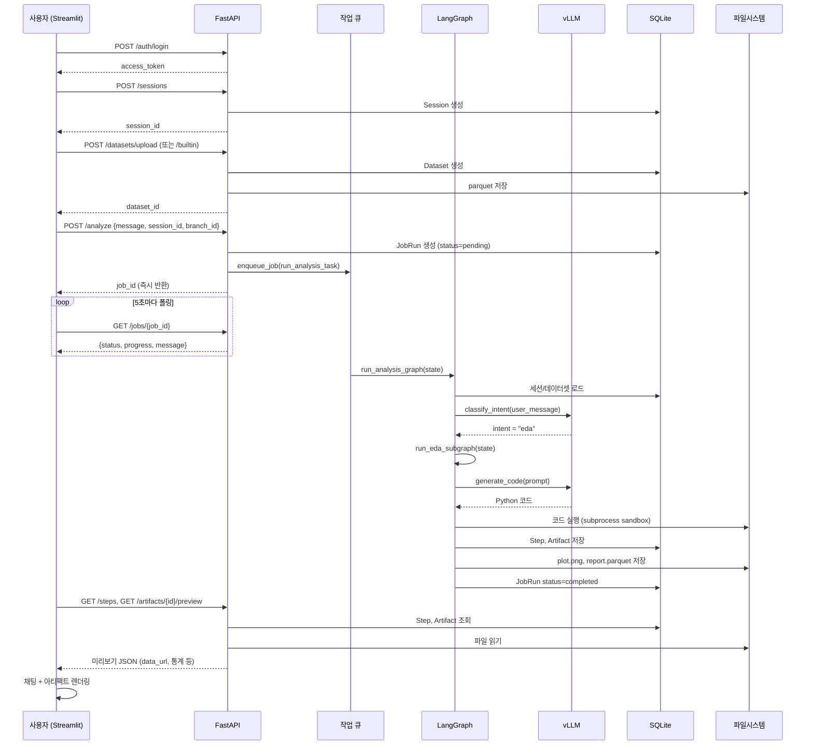

### 4.2 분석 세션 데이터 모델

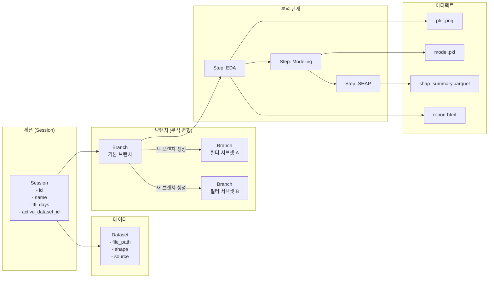

### 4.3 아티팩트 계보 (Lineage)

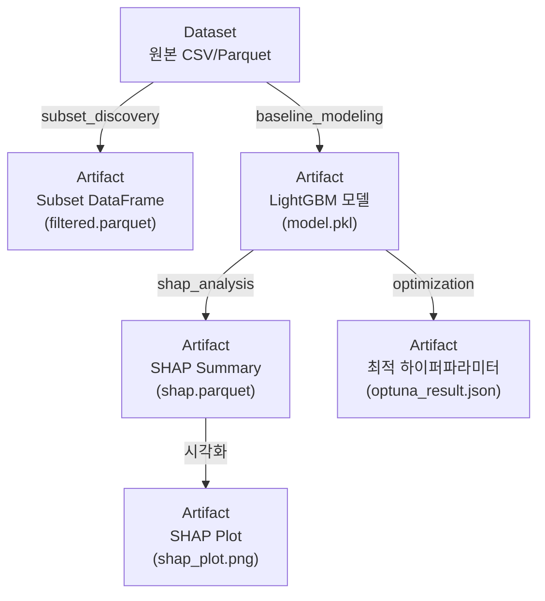

---

## 5. LangGraph 워크플로우

### 5.1 메인 그래프

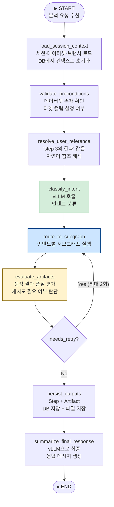

### 5.2 인텐트 → 서브그래프 라우팅

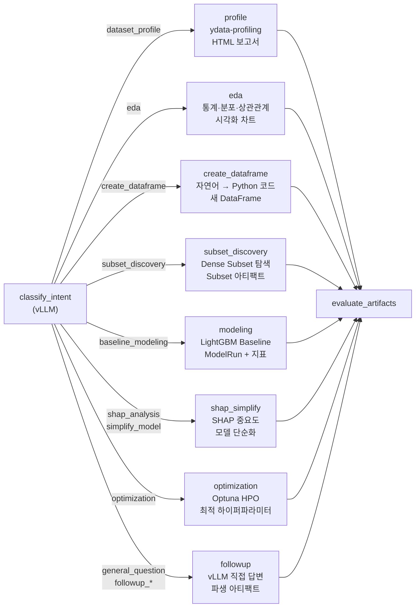

### 5.3 코드 실행 파이프라인

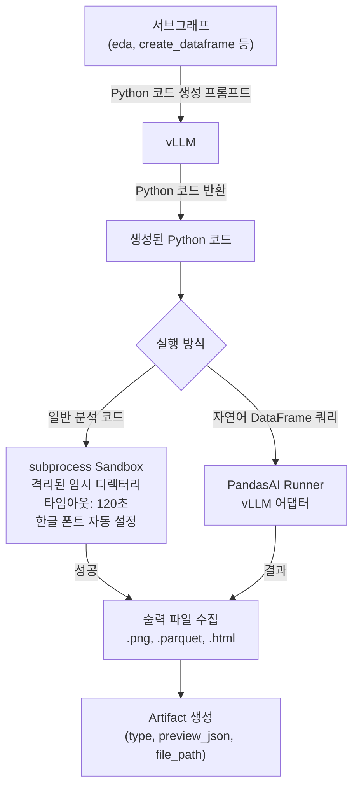

### 5.4 GraphState 구조

```mermaid
graph LR
    subgraph INPUT["입력 필드"]
        I1["session_id"]
        I2["branch_id"]
        I3["user_message"]
        I4["target_column"]
        I5["mode (auto/eda/...)"]
    end

    subgraph CONTEXT["컨텍스트 (로드 후)"]
        C1["dataset_path"]
        C2["dataset_meta"]
        C3["resolved_step_ids"]
        C4["resolved_artifact_ids"]
    end

    subgraph EXECUTION["실행 상태"]
        E1["intent"]
        E2["execution_result\n{success, stdout, output_files}"]
        E3["created_artifact_ids"]
        E4["retry_count"]
        E5["retry_hypothesis"]
        E6["needs_retry"]
    end

    subgraph OUTPUT["출력 필드"]
        O1["assistant_message"]
        O2["created_step_id"]
        O3["progress_percent"]
        O4["error_code"]
        O5["job_run_id"]
    end

    INPUT --> CONTEXT --> EXECUTION --> OUTPUT
```

---

## 6. API 구조

### 6.1 엔드포인트 맵

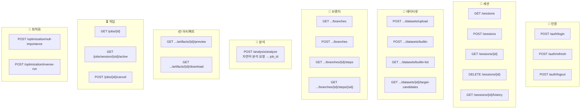

### 6.2 분석 요청 흐름

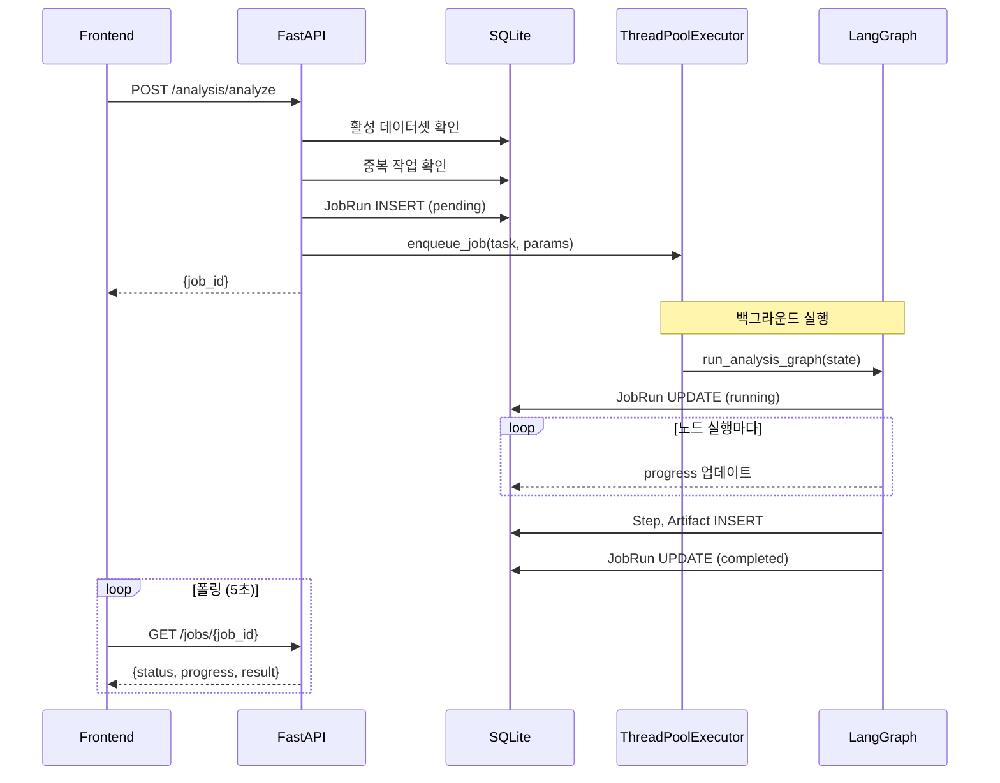

---

## 7. 데이터베이스 스키마

### 7.1 ERD

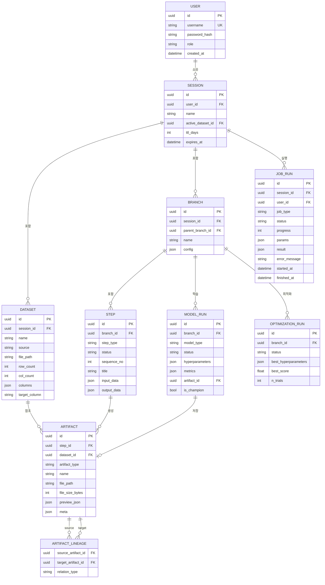

### 7.2 Artifact 타입별 저장 형태

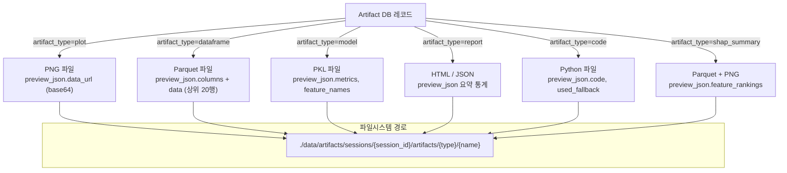

---

## 8. Frontend 구조

### 8.1 Streamlit 화면 레이아웃

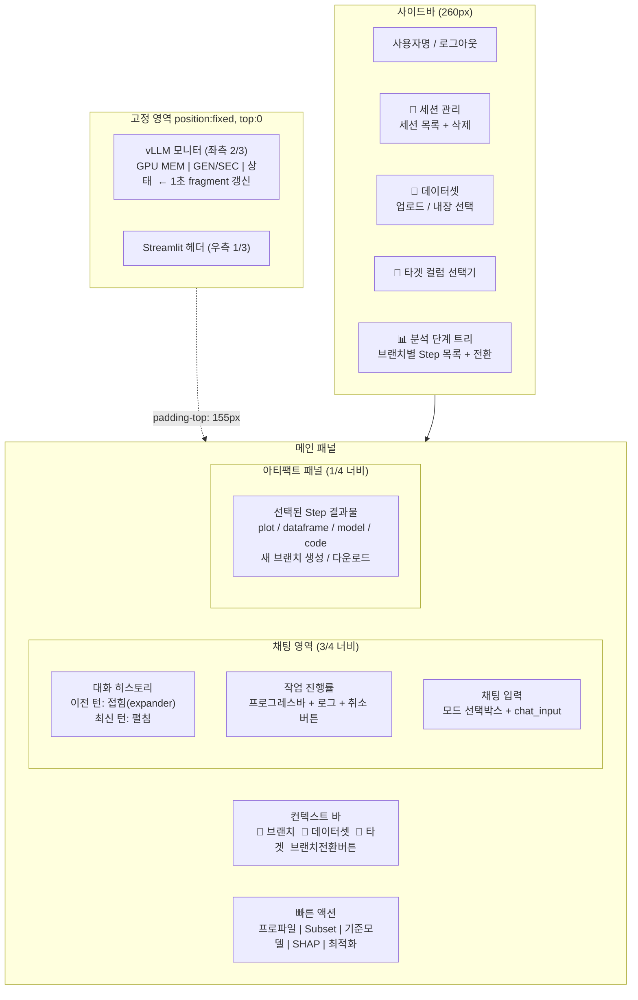

### 8.2 채팅 상태 관리

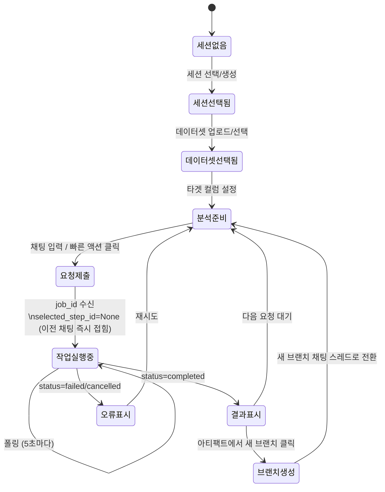

### 8.3 브랜치별 채팅 히스토리 구조

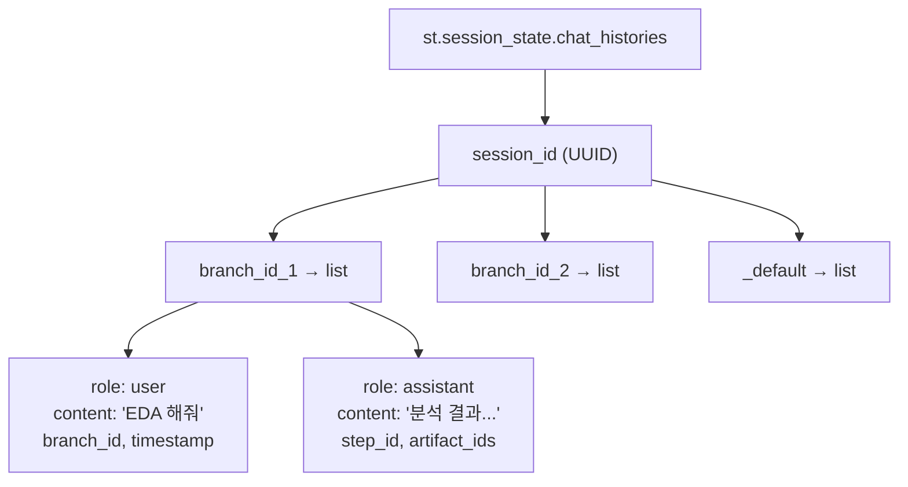

---

## 9. 설치 및 실행

### 9.1 원샷 설치 (빈 서버 / Docker)

```bash
# root 권한으로 실행 — vLLM 주소만 입력하면 자동 완료
sudo bash one-shot.sh
```

**동작 순서:**
1. OS 감지 → 시스템 패키지 설치 (apt/apk/dnf/yum 자동 선택)
2. uv + Python 3.11 설치
3. 저장소 클론
4. vLLM 엔드포인트 입력 → 모델 목록 자동 조회 → 선택
5. 백엔드/프론트엔드 의존성 설치
6. DB 마이그레이션 + 시드 데이터 + 내장 데이터셋 생성
7. 백엔드 시작 (`nohup`) → 프론트엔드 시작 (`streamlit`)

### 9.2 수동 설치

```bash
# 1. 환경 변수 설정
cp .env.example .env
# .env 편집: VLLM_ENDPOINT_SMALL, VLLM_MODEL_SMALL, SECRET_KEY

# 2. 백엔드 의존성 + DB 초기화
cd backend
uv sync
uv run alembic upgrade head
uv run python -m app.db.seed

# 3. 내장 데이터셋 생성
cd ../datasets_builtin && uv run python generate_datasets.py

# 4. 프론트엔드 의존성
cd ../frontend && uv sync

# 5. 서비스 시작
cd ../backend
nohup uv run uvicorn app.main:app --host 0.0.0.0 --port 8000 &

cd ../frontend
STREAMLIT_SERVER_HEADLESS=true streamlit run app/main.py --server.port 8501
```

### 9.3 접속 정보

| 서비스 | 주소 | 기본 계정 |
|--------|------|-----------|
| Streamlit UI | http://localhost:8501 | `demo_user_1` / `Demo123!` |
| FastAPI Swagger | http://localhost:8000/docs | — |

---

## 10. 환경 변수

| 변수 | 기본값 | 설명 |
|------|--------|------|
| `VLLM_ENDPOINT_SMALL` | — | vLLM 서버 주소 **(필수)** |
| `VLLM_MODEL_SMALL` | — | 모델명 **(필수)** |
| `VLLM_TEMPERATURE` | `0.1` | LLM 온도 |
| `VLLM_MAX_TOKENS` | `4096` | 최대 토큰 수 |
| `DATABASE_PATH` | `./data/app.db` | SQLite DB 경로 |
| `SECRET_KEY` | — | JWT 서명 키 **(필수)** |
| `ACCESS_TOKEN_EXPIRE_MINUTES` | `60` | 액세스 토큰 만료 |
| `ARTIFACT_STORE_ROOT` | `./data/artifacts` | 아티팩트 저장 경로 |
| `BUILTIN_DATASET_PATH` | `./datasets_builtin` | 내장 데이터셋 경로 |
| `MAX_UPLOAD_MB` | `100` | 최대 업로드 크기 |
| `MAX_SHAP_ROWS` | `5000` | SHAP 최대 샘플 수 |
| `JOB_TIMEOUT_SECONDS` | `600` | 작업 타임아웃 |
| `DEFAULT_SESSION_TTL_DAYS` | `7` | 세션 기본 유효 기간 |
| `APP_ENV` | `development` | 실행 환경 |
| `LOG_LEVEL` | `INFO` | 로그 레벨 |
| `VLLM_METRICS_URL` | — | vLLM Prometheus 메트릭 URL (모니터용) |
