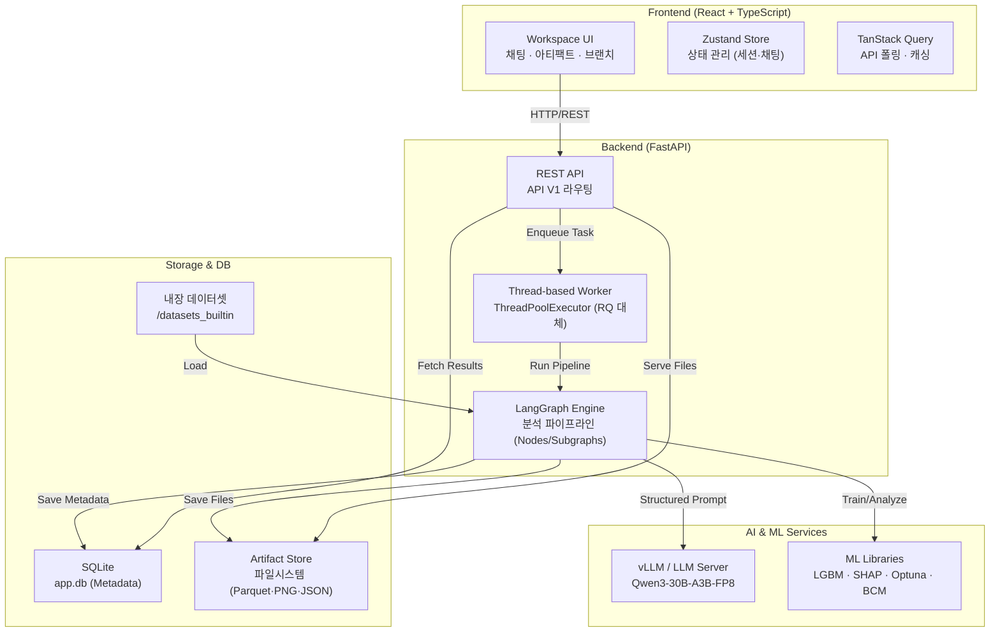
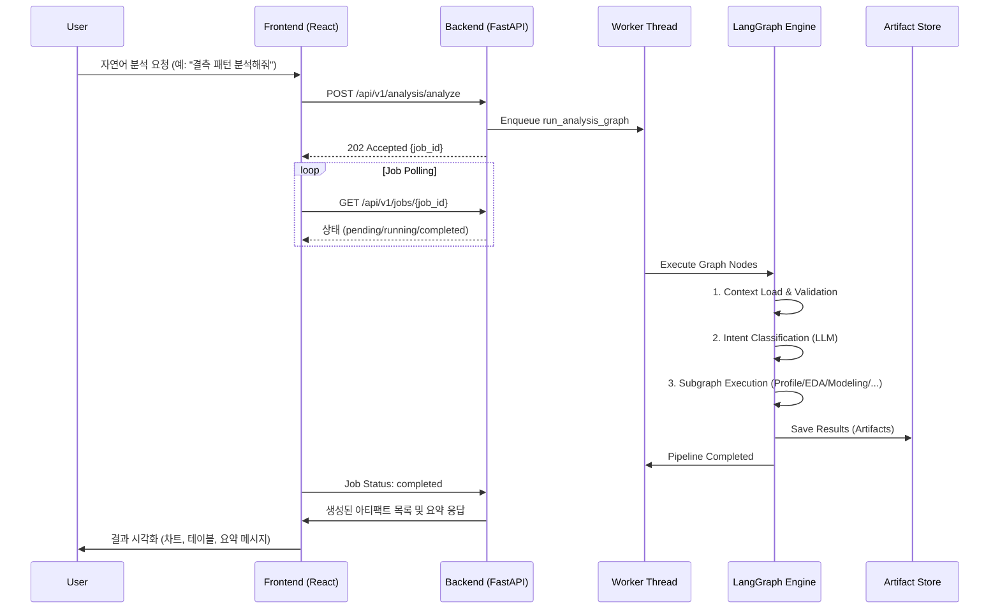

# Data_LG — 자연어 기반 회귀 분석 플랫폼

Data_LG는 **vLLM + LangGraph**를 기반으로 하는 멀티턴 자연어 데이터 분석 플랫폼입니다. 사용자는 복잡한 코드 작성 없이 자연어만으로 데이터 업로드부터 프로파일링, 결측 기반 서브셋 발견, 계층적 모델링, SHAP 분석, 그리고 BCM 기반 역최적화까지 수행할 수 있습니다.

---

## 주요 특징

- **자연어 인터페이스**: 의도 분류(`classify_intent`)를 통해 사용자의 모호한 요청을 정교한 분석 파이프라인으로 연결합니다.
- **LangGraph 기반 워크플로우**: 분석 단계를 노드 단위로 관리하여 유연한 에러 복구와 멀티턴 컨텍스트 유지를 지원합니다.
- **결측 구조 기반 Subset Discovery**: 단순 imputation 대신 데이터의 결측 패턴을 분석하여 신뢰도 높은 분석 대상 그룹(Dense Subset)을 자동으로 탐색합니다.
- **고도화된 모델링**: LightGBM 기반의 Baseline 모델링뿐만 아니라 계층적(Hierarchical) 모델링, Decision Tree 기반 임계값 분류 등을 지원합니다.
- **최적화 위저드**: Null Importance 피처 선정, BCM(Bayesian Committee Machine) 선학습, 제약 조건 기반 역최적화(Inverse Optimization)를 단계별로 수행합니다.
- **OFAT 일관성 분석**: 특정 변수의 변화가 타겟에 미치는 영향을 다른 변수들을 고정한 상태에서 분석하여 데이터의 일관성을 검증합니다.
- **Artifact & Lineage**: 모든 분석 결과(Dataframe, Plot, Model, Report)는 아티팩트로 저장되며, 데이터의 흐름과 계보를 추적할 수 있습니다.

---

## 시스템 아키텍처



---

## 데이터 분석 흐름 (Data Flow)



---

## 주요 분석 모듈 (Subgraphs)

### 1. Subset Discovery
- **전략**: 결측 서명(Missing Signature), 저카디널리티 계층화(Low-cardinality Stratification) 등을 통해 밀집된 데이터 서브셋을 탐색합니다.
- **결과**: `subset_registry`, `nullity_heatmap`, `subset_N.parquet` 등을 생성합니다.

### 2. Modeling & Analysis
- **Baseline Modeling**: LightGBM을 사용하여 최적의 모델을 학습하고 리더보드를 관리합니다.
- **Hierarchical Modeling**: 중간 변수($y_1$)를 포함한 2단계 모델링으로 복잡한 인과 관계를 분석합니다.
- **SHAP & Simplify**: SHAP 기반으로 핵심 인자를 도출하고, 모델 성능 저하를 최소화하면서 피처 수를 줄인 단순 모델을 제안합니다.

### 3. Optimization Wizard
- **Null Importance**: 순열(Permutation) 분석을 통해 통계적으로 유의미한 핵심 피처를 선별합니다.
- **BCM Pretrain**: 가우시안 프로세스 전문가(GPR Experts)를 결합한 Bayesian Committee Machine으로 불확실성을 포함한 예측을 지원합니다.
- **Constrained Inverse Optimization**: 타겟 목표값과 피처/조성 제약 조건을 만족하는 최적의 입력 조건을 탐색합니다.

### 4. OFAT (One-Factor-At-a-Time)
- **일관성 검증**: 다른 변수를 고정한 상태에서 특정 변수($x$)와 타겟($y$) 간의 관계를 그룹화하여 분석합니다.
- **지표**: 방향 일관성 지수(Consistency Index), 가중 평균 기울기(Weighted Slope), p-value 등을 제공합니다.

---

## 시작하기

### 설치 환경
- **OS**: Linux (권장)
- **Python**: 3.11+
- **Database**: SQLite
- **LLM**: vLLM 서버 (Qwen3-30B급 권장)

### 설치 및 실행
```bash
# 1. 의존성 설치 및 환경 설정 (interactive)
bash install.sh

# 2. 서비스 실행 (Frontend, Backend, Worker 동시 실행)
bash run.sh
```

### 기본 계정 (Seed Data)
| 역할 | 아이디 | 비밀번호 |
|------|--------|----------|
| 관리자 | `admin` | `Admin123!` |
| 테스트 유저 | `demo_user_1` | `Demo123!` |

---

## 기술 스택

- **Frontend**: React 18, TypeScript, Tailwind CSS, Zustand, TanStack Query
- **Backend**: FastAPI, SQLAlchemy 2.0 (Async), Pydantic v2
- **Workflow**: LangGraph (LangChain ecosystem)
- **Data/ML**: Pandas, LightGBM, SHAP, Optuna, Scipy, Matplotlib, Seaborn
- **Storage**: SQLite (aiosqlite), Local Filesystem

---

## 디렉토리 구조

```text
Data_LG/
├── backend/
│   ├── app/
│   │   ├── api/v1/          # REST API 엔드포인트
│   │   ├── core/            # 설정, 로깅
│   │   ├── db/              # SQLAlchemy 모델 및 Repository
│   │   ├── graph/           # LangGraph 메인 그래프 및 노드
│   │   │   ├── nodes/       # 인텐트 분류, 검증 노드
│   │   │   └── subgraphs/   # EDA, 모델링, 서브셋 분석 등
│   │   ├── schemas/         # Pydantic 스키마
│   │   ├── services/        # 아티팩트, 세션, 계보 관리 서비스
│   │   └── worker/          # 비동기 작업 및 최적화 태스크
├── frontend-react/
│   ├── src/
│   │   ├── components/      # UI 컴포넌트 (Chat, Artifact, OptWizard)
│   │   ├── store/           # Zustand 상태 관리
│   │   └── api/             # API 클라이언트
├── datasets_builtin/        # 내장 테스트 데이터셋 (.parquet, .csv)
├── 계획/                    # 기획 및 설계 문서
└── README.md                # 프로젝트 개요 (본 문서)
```
