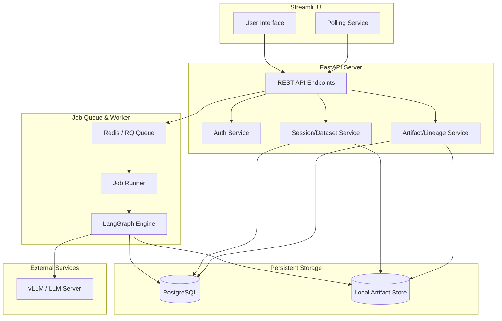
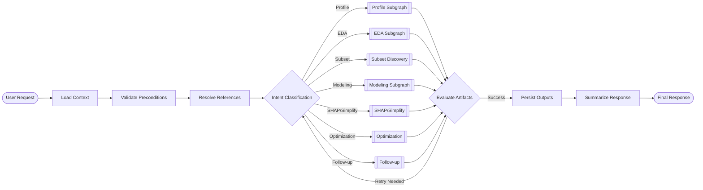
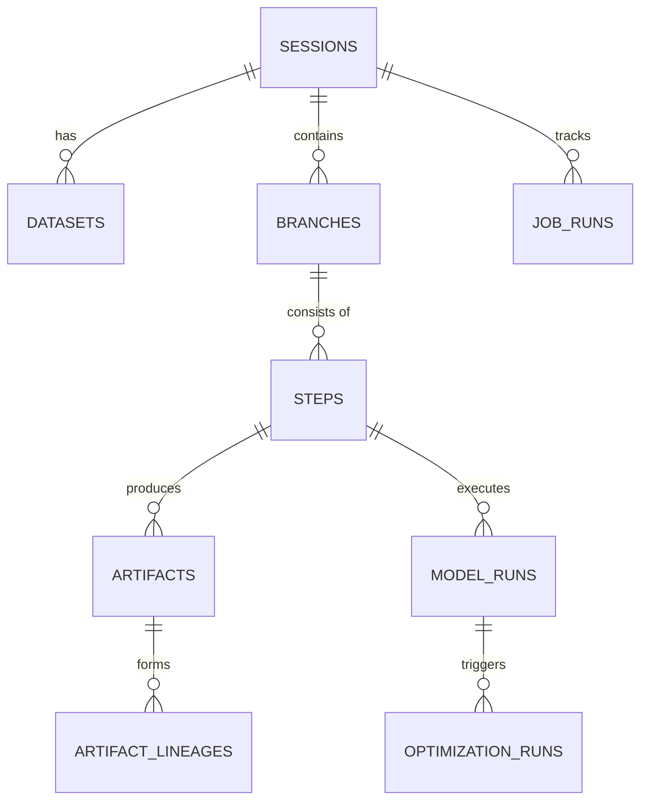

# Project Review: Data_LG (Tabular Regression Analysis Platform)

본 문서는 **vLLM + LangGraph** 기반의 멀티턴 tabular 회귀 분석 플랫폼인 **Data_LG** 프로젝트의 현재 구현 상태를 정리한 리뷰 보고서입니다.

---

## 1. 시스템 아키텍처 개요

Data_LG는 프론트엔드(Streamlit)와 백엔드(FastAPI)가 분리된 구조로, 장시간 분석 작업은 Redis 기반의 Job Queue를 통해 비동기로 처리됩니다. 분석 엔진은 LangGraph를 사용하여 유연한 워크플로우 제어와 멀티턴 대화 문맥 유지를 수행합니다.

### 🏗️ 고수준 아키텍처 (High-Level Architecture)

---

## 2. 데이터 파이프라인 및 워크플로우

사용자의 요청부터 최종 분석 결과 저장까지의 흐름은 **Main Graph**와 전문화된 **Subgraphs**를 통해 관리됩니다.

### 🔄 메인 분석 그래프 (Main Analysis Graph)

---

## 3. 모듈별 기능 설명

### 📂 Backend (`backend/app/`)
- **`api/v1/`**: 세션 관리, 데이터셋 업로드, 분석 요청, 결과 조회 등을 담당하는 RESTful API.
- **`graph/`**: LangGraph 기반의 분석 엔진.
    - `nodes/`: 인텐트 분류, 참조 해결, 데이터 영속화 등 공통 노드.
    - `subgraphs/`: EDA, 모델링, 최적화 등 도메인별 전문 분석 로직.
- **`services/`**: 비즈니스 로직 처리.
    - `artifact_service.py`: 분석 산출물(Dataframe, Plot, Code 등)의 저장 및 조회.
    - `lineage_service.py`: 산출물 간의 계보(Lineage) 추적.
- **`worker/`**: Redis Queue 기반의 비동기 작업 처리 엔진 및 취소/진행률 관리.

### 📂 Frontend (`frontend/app/`)
- **Streamlit App**: 대화형 UI를 통해 데이터 업로드, 분석 과정 모니터링, 결과 시각화 제공.
- **State Management**: 백엔드 API와의 Polling을 통해 실시간 진행 상태 갱신.

### 📂 Shared & Datasets (`shared/`, `datasets_builtin/`)
- **`shared/`**: 백엔드와 프론트엔드 간 공통 데이터 모델(Pydantic) 정의.
- **`datasets_builtin/`**: 제조, 계측 등 4종의 시나리오 기반 테스트 데이터셋 생성기 및 저장소.

---

## 4. 구현 상태 요약 (Implementation Status)

| 기능 영역 | 상태 | 설명 |
| :--- | :---: | :--- |
| **인프라/환경** | ✅ 완료 | Docker Compose, PostgreSQL, Redis, uv 기반 환경 구성 |
| **인증/세션** | ✅ 완료 | JWT 기반 인증 및 7일 TTL 세션 관리 |
| **데이터셋 관리** | ✅ 완료 | 파일 업로드, 내장 데이터셋 선택, 프로파일링(Target 추천) |
| **Step/Artifact** | ✅ 완료 | 분석 단계별 결과 저장 및 계보(Lineage) 추적 시스템 |
| **비동기 작업** | ✅ 완료 | RQ 기반 Job Queue, 5초 Polling, 취소 기능 구현 |
| **LangGraph 엔진** | ✅ 완료 | 메인 그래프 및 8종의 서브그래프 연동 구조 완성 |
| **EDA/Subset** | ✅ 완료 | 결측 구조 기반 Dense Subset Discovery 및 자동 EDA |
| **Modeling** | ✅ 완료 | LightGBM Baseline 모델링 및 리더보드 관리 |
| **SHAP/Simplify** | ✅ 완료 | SHAP 해석 및 중요 변수 기반 모델 단순화 제안 |
| **Optimization** | ✅ 완료 | Grid Search 및 Optuna 자동 선택 최적화 파이프라인 |

---

## 5. 핵심 엔티티 구조 (Database Schema)

시스템의 영속적 상태는 다음과 같은 핵심 엔티티 간의 관계를 통해 유지됩니다.

---

## 6. 향후 계획 및 하드닝
- **Repair Loop 고도화**: LLM의 코드 생성 오류 발생 시 자동 수정(Self-correction) 로직 강화.
- **시각화 엔진 확장**: Plotly 등 인터랙티브 차트 지원 범위 확대.
- **성능 최적화**: 대용량 데이터셋 처리를 위한 샘플링 및 데이터 로딩 전략 고도화.
- **E2E 테스트 강화**: 시나리오별 통합 테스트 자동화 및 엣지 케이스 검증.
