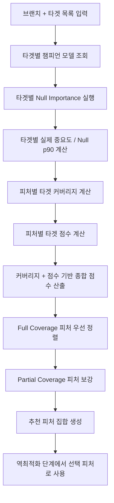
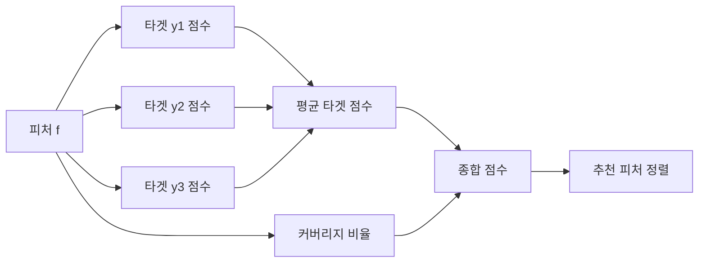

# 다중 타겟 최적 피처 선택 알고리즘 설명

이 문서는 모델 기반 최적화 위저드에서 사용하는 다중 타겟 피처 유의성 분석과 합성 피처 선택 로직을 설명한다.

관련 구현:
- [backend/app/api/v1/routes/optimization.py](/home/dawson/project/work/Data_LG/backend/app/api/v1/routes/optimization.py)
- [backend/app/worker/inverse_optimize_tasks.py](/home/dawson/project/work/Data_LG/backend/app/worker/inverse_optimize_tasks.py)
- [frontend-react/src/components/optimization/InverseOptimizationModal.tsx](/home/dawson/project/work/Data_LG/frontend-react/src/components/optimization/InverseOptimizationModal.tsx)

## 목적

타겟이 2개 이상일 때, 피처 유의성 분석을 하나의 타겟에만 맞추면 다른 타겟을 설명하는 데 중요한 피처가 누락될 수 있다.  
반대로 각 타겟의 상위 피처를 단순 합집합으로 묶으면 피처 수가 과도하게 늘고, 실제 최적화 단계에서 탐색 공간이 불필요하게 커진다.

그래서 현재 알고리즘은 다음 두 목표를 동시에 만족하도록 설계되었다.

1. 각 타겟에 대해 독립적으로 유의성 분석을 수행한다.
2. 여러 타겟을 함께 잘 설명하는 피처를 우선하는 합성 랭킹을 만든다.

## 전체 흐름



## 1. 타겟별 독립 Null Importance

각 타겟 `t`에 대해 해당 타겟의 챔피언 모델을 찾고, 그 모델이 학습된 데이터셋과 피처 목록을 사용해 독립적으로 Null Importance를 계산한다.

각 타겟별 산출물:

- `actual_importance[f]`
  실제 모델의 SHAP 기반 중요도
- `null_importance[f].p90`
  타겟 값을 순열 섞은 뒤 재학습한 Null 분포의 90 percentile
- `significant_features`
  `actual_importance[f] > null_p90[f]` 인 피처
- `feature_ranges`
  역최적화 탐색 공간용 피처 최소/최대값

판정 기준:

```text
significant(f, t) = 1 if actual_importance(f, t) > null_p90(f, t)
                  = 0 otherwise
```

의미:

- 실제 모델에서의 중요도가 우연히 생길 수 있는 Null 중요도보다 충분히 크면 유의하다고 본다.
- 이 단계는 타겟마다 독립적이다.

## 2. 다중 타겟 통합의 핵심 아이디어

다중 타겟에서 좋은 피처는 보통 다음 두 부류다.

1. 여러 타겟에서 공통으로 유의한 피처
2. 특정 타겟에는 매우 강하지만 다른 타겟에는 약한 피처

현재 알고리즘은 1번을 우선하고, 2번은 보강용으로 채택한다.

즉 기본 철학은 다음과 같다.

- 먼저 "얼마나 많은 타겟을 커버하는가"를 본다.
- 그 다음 "각 타겟 안에서 얼마나 강한가"를 본다.

## 3. 타겟별 점수 계산

피처 `f`, 타겟 `t`에 대해 다음 값을 계산한다.

### 3-1. 정규화 중요도

타겟마다 중요도 스케일이 다를 수 있으므로, 각 타겟 내부 최대 중요도로 나눈다.

```text
normalized(f, t) = actual_importance(f, t) / max_actual_importance(t)
```

여기서:

- `max_actual_importance(t)`는 타겟 `t`에서 가장 큰 실제 중요도

### 3-2. Null 대비 초과 정도

중요도가 Null p90을 얼마나 넘었는지 본다.

```text
margin(f, t) = max(actual_importance(f, t) - null_p90(f, t), 0)
relative_margin(f, t) = margin(f, t) / max(actual_importance(f, t), null_p90(f, t), 1e-9)
```

의미:

- Null을 barely 넘는 피처보다, 명확하게 넘는 피처를 더 높게 평가한다.

### 3-3. 타겟별 피처 점수

현재 구현은 다음 가중치로 타겟별 점수를 만든다.

```text
target_score(f, t) = 0.65 * normalized(f, t) + 0.35 * relative_margin(f, t)
```

가중치 해석:

- `0.65`: 그 타겟 안에서의 상대적 중요도
- `0.35`: Null 기준을 얼마나 여유 있게 넘는지

즉, 중요도 자체를 더 중시하되, 유의성의 안정성도 반영한다.

## 4. 커버리지 계산

피처 `f`가 몇 개의 타겟에서 유의한지 센다.

```text
coverage_count(f) = sum_t significant(f, t)
coverage_ratio(f) = coverage_count(f) / number_of_targets
```

예시:

- 타겟 2개 중 2개 모두 유의하면 `coverage_ratio = 1.0`
- 2개 중 1개만 유의하면 `coverage_ratio = 0.5`

이 값은 다중 타겟 최적화에서 가장 중요한 신호다.  
여러 타겟에서 반복적으로 중요한 피처는 실제로 더 안정적인 공통 설명 변수일 가능성이 높다.

## 5. 종합 점수 계산

각 피처의 최종 종합 점수는 다음처럼 만든다.

```text
mean_target_score(f) = average_t target_score(f, t)
aggregate_score(f) = 0.55 * coverage_ratio(f) + 0.45 * mean_target_score(f)
```

가중치 해석:

- `0.55`: 다중 타겟 커버리지 우선
- `0.45`: 개별 타겟에서의 상대적 강도 반영

이 설계는 다음 문제를 피하려는 의도다.

- 단순 평균 중요도만 쓰면 한 타겟에서만 강한 피처가 너무 위로 올라옴
- 단순 교집합만 쓰면 보강용 피처를 지나치게 버리게 됨

## 6. 최종 피처 정렬 규칙

정렬은 단순히 `aggregate_score` 하나로 끝내지 않는다.  
먼저 커버리지 계층을 나누고, 그 안에서 종합 점수를 정렬한다.

정렬 우선순위:

```text
1. coverage_count 내림차순
2. aggregate_score 내림차순
3. feature 이름 오름차순
```

그 다음 피처를 세 그룹으로 나눈다.

- `Full Coverage`
  모든 타겟에서 유의
- `Partial Coverage`
  일부 타겟에서만 유의
- `No Coverage`
  어떤 타겟에서도 유의하지 않음

최종 추천 피처 순서:

```text
recommended_features = Full Coverage
                     + Partial Coverage
                     + No Coverage
```

이렇게 하면:

- 공통 핵심 피처가 항상 앞에 오고
- 타겟 특화 피처가 그 뒤를 보강하며
- 정말 후보가 부족할 때만 비유의 피처가 마지막 안전망으로 들어간다

## 7. 추천 피처 수 결정

현재 구현은 추천 피처 수를 아래 기준으로 제한한다.

```text
recommended_n = min(
    len(recommended_features),
    max(3, min(15, len(full_coverage) + max(1, number_of_targets)))
)
```

의도:

- 최소 3개는 확보
- 최대 15개를 넘기지 않음
- 공통 피처 수에 타겟 수만큼의 보강 슬롯을 더 줌

예를 들어 타겟이 2개이고 공통 유의 피처가 4개면:

```text
recommended_n = min(total, max(3, min(15, 4 + 2))) = min(total, 6)
```

즉 공통 피처 4개에, 타겟 특화 피처 2개 정도를 추가로 포함하는 구조다.

## 8. 왜 단순 합집합보다 나은가

단순 합집합은 아래 문제가 있다.

- 타겟별 상위 피처를 모두 모으면 피처 수가 너무 커짐
- 중복 설명력이 큰 피처가 다수 남을 수 있음
- 실제 최적화 시 탐색 공간이 커져 수렴이 느려질 수 있음

현재 방식의 장점:

- 여러 타겟에 공통으로 중요한 피처를 우선 확보
- 한 타겟에 특화된 피처도 보강용으로 남김
- 설명력과 안정성을 동시에 반영
- 구현이 비교적 단순하고 해석 가능함

## 9. 예시

타겟이 `y1`, `y2` 두 개이고 피처가 다음과 같다고 가정한다.

| 피처 | y1 유의 | y2 유의 | 해석 |
|---|---|---|---|
| A | O | O | 공통 핵심 피처 |
| B | O | X | y1 특화 |
| C | X | O | y2 특화 |
| D | X | X | 비유의 |

이때 정렬은 보통 다음처럼 된다.

```text
1. A   (coverage 2/2)
2. B   (coverage 1/2, 점수 높음)
3. C   (coverage 1/2, 점수 높음)
4. D   (coverage 0/2)
```

즉 공통 피처 `A`가 먼저 선택되고, 부족한 설명력을 `B`, `C`가 보완한다.

## 10. Mermaid로 보는 점수 구조



## 11. 현재 알고리즘의 성격

현재 방식은 다음 성격을 가진다.

- `coverage-aware union`
- `importance-weighted ranking`
- `significance-thresholded selection`

즉 "교집합만 고집하지도 않고, 합집합을 무작정 늘리지도 않는" 절충형 알고리즘이다.

## 12. 한계

현재 알고리즘은 해석 가능성과 구현 단순성에 초점을 둔 방식이다. 따라서 다음 한계가 있다.

1. 피처 간 중복성(redundancy)을 직접 제거하지 않는다.
2. 타겟 간 상충 관계를 직접 모델링하지 않는다.
3. 종합 점수 가중치 `0.55 / 0.45`, `0.65 / 0.35`는 현재 휴리스틱이다.
4. 타겟 수가 매우 많아지면 추천 피처 수 정책을 다시 조정할 필요가 있다.

## 13. 향후 고도화 후보

더 정교한 방식이 필요하면 아래 순서로 발전시키는 것이 좋다.

### 13-1. mRMR 추가

`Max-Relevance Min-Redundancy`를 적용하면:

- 타겟 설명력이 큰 피처를 유지하면서
- 서로 지나치게 비슷한 피처는 줄일 수 있다

추천 용도:

- 선택 피처 수가 많아질 때
- 상관된 피처가 많은 공정 데이터에서

### 13-2. Submodular Set Cover

각 피처가 "어느 타겟을 얼마나 설명하는지"를 커버 함수로 보고,
제한된 개수 안에서 최대 커버리지를 가지는 피처 집합을 고르는 방식이다.

장점:

- "적은 수의 피처로 많은 타겟을 설명"하는 목적에 잘 맞음

### 13-3. Pareto 기반 다목적 선택

타겟별 중요도를 각각 독립 objective로 보고,
Pareto front에서 피처 집합을 선택하는 방법도 가능하다.

장점:

- 타겟 간 trade-off가 큰 경우 더 정교함

단점:

- UI와 해석이 복잡해짐

## 14. 결론

현재 구현은 다중 타겟 피처 선택에서 다음 원칙을 따른다.

1. 타겟별 Null Importance는 반드시 각각 수행한다.
2. 피처 선택은 단순 합집합이 아니라 커버리지 중심으로 통합한다.
3. 공통 유의 피처를 우선하고, 타겟 특화 피처는 보강용으로 포함한다.
4. 결과는 해석 가능해야 하며, 실제 역최적화 탐색 공간을 과도하게 키우지 않아야 한다.

실무적으로 이 방식은 다음 상황에 적합하다.

- 타겟이 2~5개 수준인 다중 타겟 문제
- 공통 설명 변수와 타겟 특화 변수가 혼재한 데이터
- 해석 가능성과 최적화 안정성을 동시에 원하는 경우

현재 구현 이름:

```text
coverage_weighted_union_v1
```

이는 "다중 타겟 커버리지를 우선하면서, 타겟별 중요도와 유의성을 함께 반영하는 합집합 기반 피처 선택"을 의미한다.
