# Data_LG 회귀 분석 플랫폼 — 파이프라인 & 아키텍처 리뷰

> 작성일: 2026-03-29
> 대상 코드베이스: `/home/dawson/project/work/Data_LG`

---

## 목차

1. [시스템 개요](#1-시스템-개요)
2. [서비스 아키텍처 (Docker Compose)](#2-서비스-아키텍처-docker-compose)
3. [전체 데이터 흐름](#3-전체-데이터-흐름)
4. [백엔드 레이어 구조](#4-백엔드-레이어-구조)
5. [LangGraph 분석 엔진](#5-langgraph-분석-엔진)
6. [인텐트 분류 및 서브그래프 라우팅](#6-인텐트-분류-및-서브그래프-라우팅)
7. [서브그래프 상세](#7-서브그래프-상세)
8. [Worker / Job 실행 시스템](#8-worker--job-실행-시스템)
9. [데이터셋 업로드 및 파싱 파이프라인](#9-데이터셋-업로드-및-파싱-파이프라인)
10. [아티팩트 저장 구조](#10-아티팩트-저장-구조)
11. [데이터베이스 스키마](#11-데이터베이스-스키마)
12. [API 엔드포인트 전체 목록](#12-api-엔드포인트-전체-목록)
13. [프론트엔드 아키텍처](#13-프론트엔드-아키텍처)
14. [vLLM 연동 구조](#14-vllm-연동-구조)
15. [코드 실행 샌드박스](#15-코드-실행-샌드박스)
16. [핵심 알고리즘 요약](#16-핵심-알고리즘-요약)
17. [보안 및 에러 핸들링](#17-보안-및-에러-핸들링)
18. [알려진 한계 및 개선 포인트](#18-알려진-한계-및-개선-포인트)

---

## 1. 시스템 개요

Data_LG는 **자연어 기반 회귀 분석 플랫폼**이다. 사용자가 CSV/XLSX/Parquet 데이터를 업로드하고 채팅 형태로 분석을 지시하면, 백엔드가 LLM으로 의도를 분류하고 적합한 분석 파이프라인을 자동 실행한다.

### 기술 스택

| 계층 | 기술 |
|------|------|
| 프론트엔드 | Streamlit 1.x |
| 백엔드 API | FastAPI + Uvicorn (Python 3.11) |
| 분석 엔진 | LangGraph (커스텀 노드 7개) |
| LLM | Qwen3-30B-A3B-FP8 (외부 vLLM 서버) |
| 비동기 작업 | RQ (Redis Queue) + RQ Scheduler |
| 데이터베이스 | PostgreSQL 16 (async: asyncpg, sync: psycopg2) |
| 캐시/큐 | Redis 7 |
| 모델링 | LightGBM, scikit-learn (RandomForest, Ridge) |
| 하이퍼파라미터 최적화 | Optuna (Bayesian) / Grid Search |
| 시각화 라이브러리 | matplotlib, seaborn, plotly |
| 파일 포맷 | Apache Parquet (내부 저장 표준) |
| 컨테이너 | Docker Compose |

---

## 2. 서비스 아키텍처 (Docker Compose)

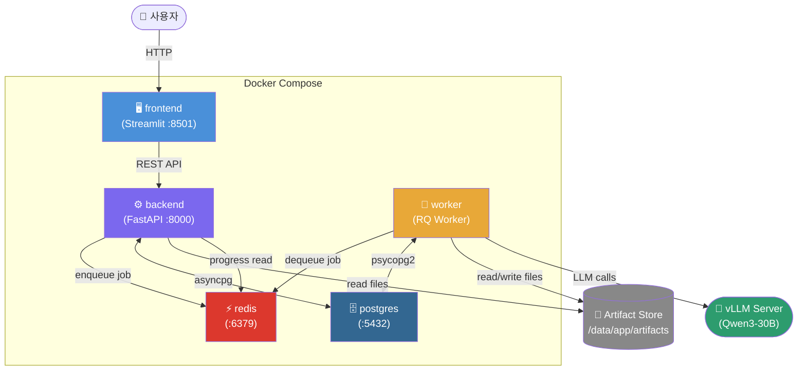

### 서비스별 역할

| 서비스 | 포트 | 역할 | 의존성 |
|--------|------|------|--------|
| `frontend` | 8501 | Streamlit UI (폴링, 채팅, 아티팩트 표시) | backend |
| `backend` | 8000 | FastAPI REST API, 요청 검증, Job 생성 | postgres, redis |
| `worker` | — | RQ 작업 소비, LangGraph 실행, 모델 학습 | postgres, redis |
| `postgres` | 5432 | 메타데이터 (세션·데이터셋·잡·아티팩트) 영속화 | — |
| `redis` | 6379 | Job Queue + 진행률 + 취소 플래그 | — |

**공유 볼륨**: `postgres_data`, `redis_data`, `/data/app/artifacts` (backend + worker 공용)

---

## 3. 전체 데이터 흐름

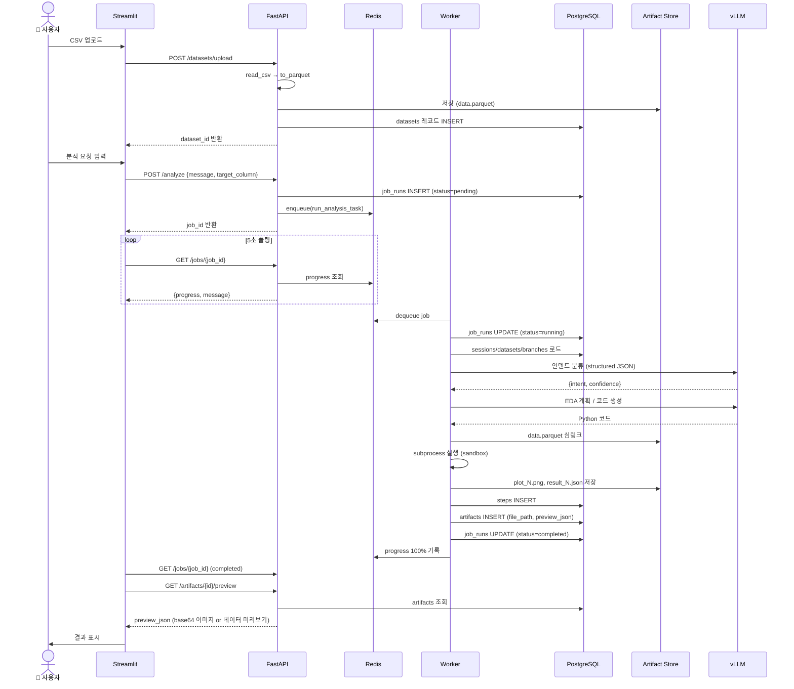

---

## 4. 백엔드 레이어 구조

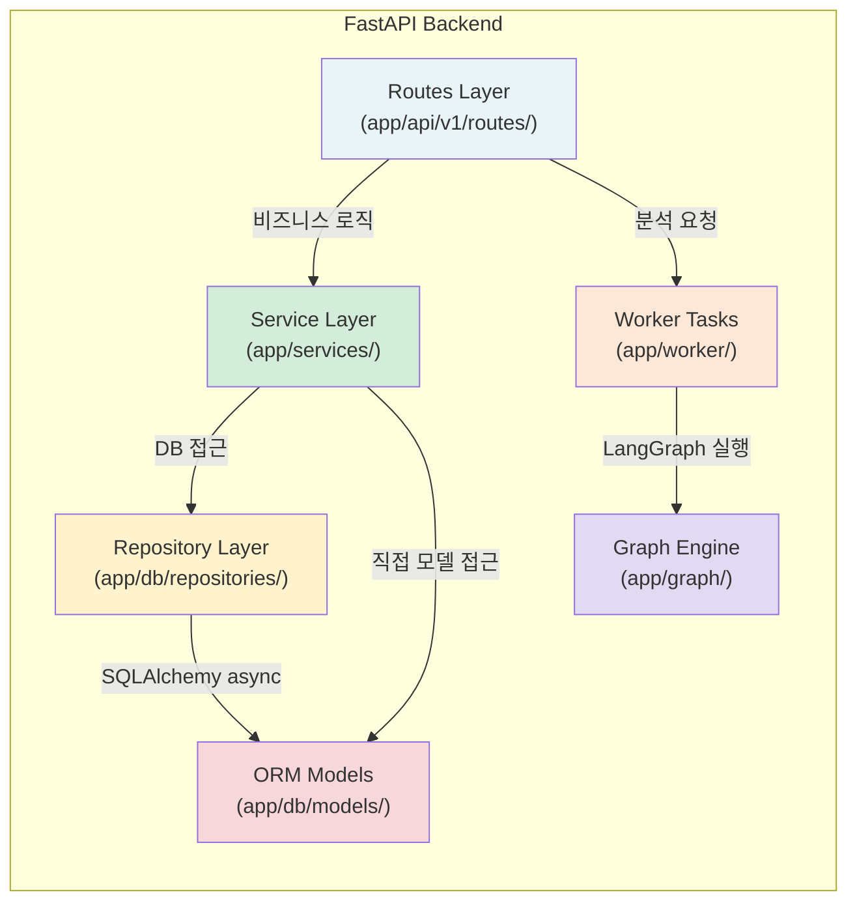

### 디렉터리 구조

```
backend/app/
├── api/v1/
│   ├── routes/
│   │   ├── auth.py          # JWT 인증
│   │   ├── sessions.py      # 세션 CRUD + 히스토리
│   │   ├── datasets.py      # 업로드/선택/프로파일/타겟후보
│   │   ├── analysis.py      # 분석 요청 (→ RQ)
│   │   ├── modeling.py      # 모델링/SHAP/단순화
│   │   ├── optimization.py  # 하이퍼파라미터 최적화
│   │   ├── jobs.py          # 잡 상태/취소
│   │   ├── artifacts.py     # 아티팩트 조회/다운로드
│   │   ├── branches.py      # 브랜치 관리
│   │   ├── steps.py         # 분석 단계 조회
│   │   └── admin.py         # 관리자 기능
│   └── router.py            # 라우터 통합
├── core/
│   ├── config.py            # 환경 변수 (vLLM, DB, Redis, 스토리지)
│   ├── logging.py           # 구조화 로깅 (structlog)
│   └── security.py          # bcrypt + JWT
├── db/
│   ├── models/              # SQLAlchemy ORM (12개 모델)
│   └── repositories/        # 데이터 접근 객체 (DAO)
├── graph/                   # LangGraph 분석 엔진
├── services/                # 비즈니스 로직
│   ├── dataset_service.py   # CSV 파싱·변환·프로파일
│   ├── profile_service.py   # 컬럼 프로파일·타겟 후보
│   ├── artifact_service.py  # 아티팩트 조회
│   ├── artifact_store.py    # 파일시스템 저장
│   ├── preview_builder.py   # 미리보기 JSON 생성
│   ├── builtin_registry.py  # 내장 데이터셋 레지스트리
│   └── lineage_service.py   # 아티팩트 계보 추적
└── worker/
    ├── tasks.py             # RQ 태스크 진입점
    ├── queue.py             # RQ 큐 관리
    ├── job_runner.py        # psycopg2 동기 DB 접근
    ├── progress.py          # Redis 진행률 업데이트
    └── cancellation.py      # 협조적 취소 플래그
```

---

## 5. LangGraph 분석 엔진

### 노드 DAG

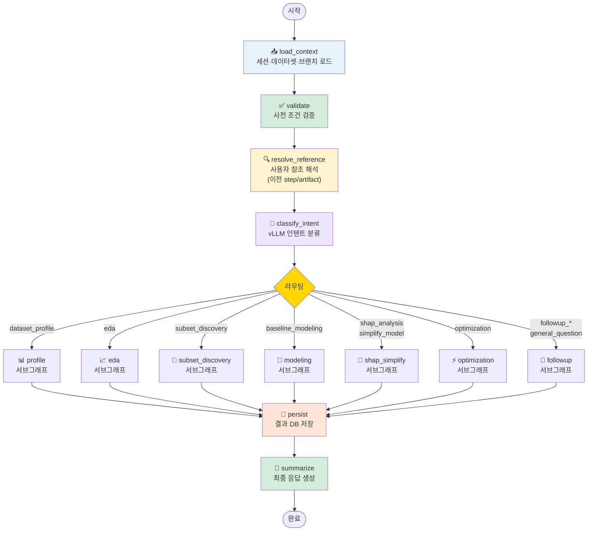

### GraphState 구조

```python
class GraphState(TypedDict):
    # 입력
    session_id: str
    user_message: str
    target_column: str
    mode: str                      # "auto" 또는 명시적 인텐트
    job_run_id: str

    # 컨텍스트 (load_context 에서 채워짐)
    session: dict
    dataset: dict
    dataset_path: str              # parquet 파일 경로
    active_branch: dict
    current_step: dict

    # 분류 결과 (classify_intent 에서 채워짐)
    intent: str
    intent_meta: dict              # confidence, reasoning, source

    # 참조 해석 (resolve_reference 에서 채워짐)
    resolved_step_ids: list
    resolved_artifact_ids: list

    # 분석 결과 (서브그래프에서 채워짐)
    created_step_id: str
    created_artifact_ids: list
    execution_result: dict
    assistant_message: str

    # 오류
    error_code: str
    error_message: str
```

---

## 6. 인텐트 분류 및 서브그래프 라우팅

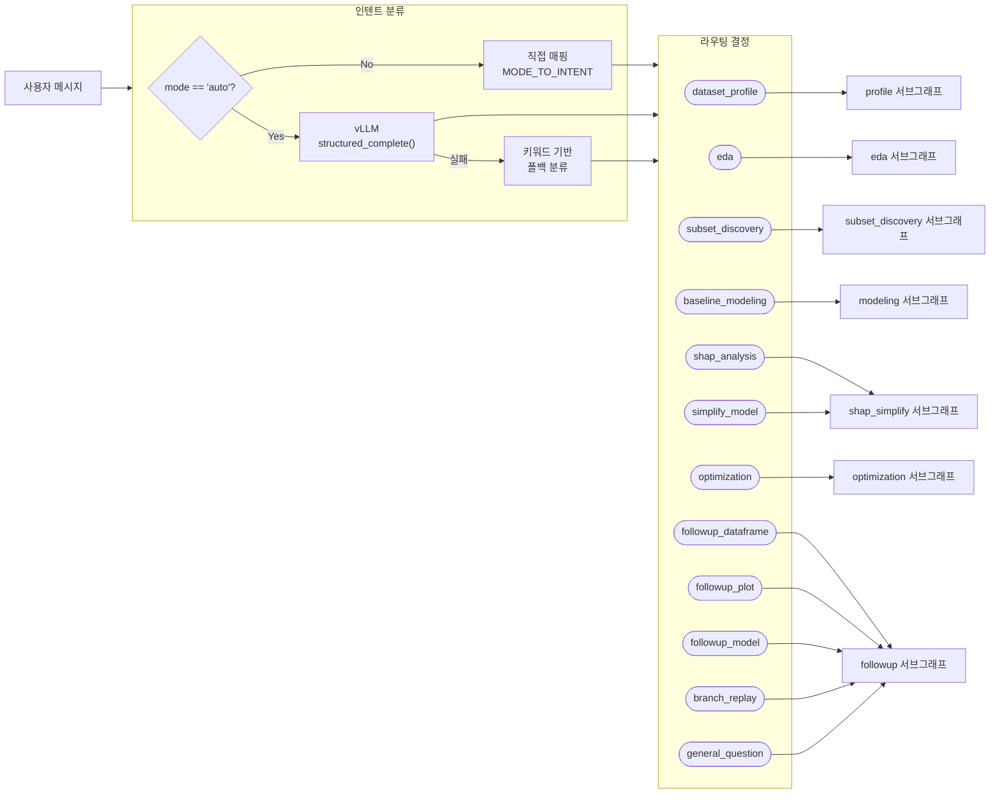

### 인텐트 분류 규칙

| 인텐트 | 트리거 조건 |
|--------|-------------|
| `dataset_profile` | "프로파일", "요약", "컬럼 정보", "결측값" 키워드 |
| `eda` | "그려줘", "시각화", "분포", "상관관계", "plot" 키워드 또는 새 플롯 생성 요청 |
| `subset_discovery` | "서브셋", "부분집합", "dense subset" |
| `baseline_modeling` | "모델", "훈련", "LightGBM", "train" |
| `shap_analysis` | "SHAP", "중요도", "피처 중요도" |
| `optimization` | "최적화", "Optuna", "Grid Search", "하이퍼파라미터" |
| `followup_plot` | 기존 플롯 **설명 요청** (그려줘 아닌 경우) |
| `followup_dataframe` | 이전 데이터 결과에 대한 수치 질문 |
| `general_question` | 기타 |

---

## 7. 서브그래프 상세

### 7-1. profile 서브그래프

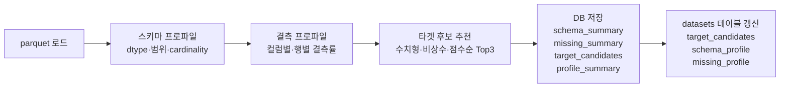

**타겟 후보 점수 공식:**
```
score = 완성도 × min(|CV|, 2.0) / 2.0 × (0.5 + 0.5 × uniqueness)

완성도   = 1 - missing_ratio
CV       = std / (mean + ε)   # 변동계수
uniqueness = n_unique / n_total
```

---

### 7-2. EDA 서브그래프

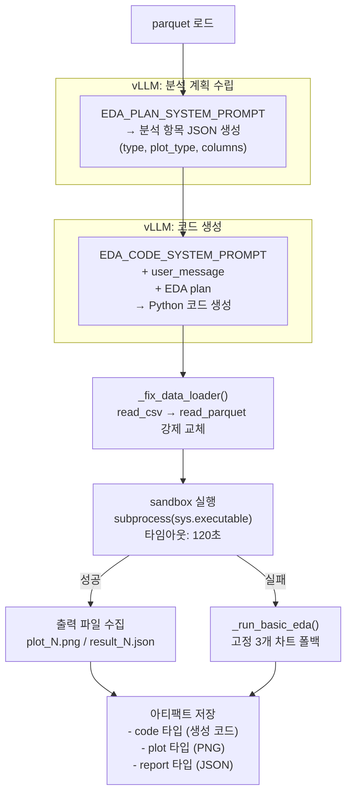

**지원 plot_type:**
`histogram`, `boxplot`, `heatmap`, `scatter`, `bar`, `pairplot`, `violin`, `kde`, `regplot`, `lineplot`

---

### 7-3. subset_discovery 서브그래프

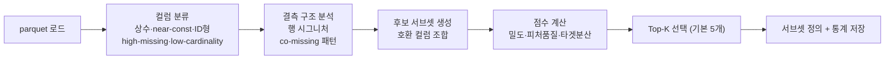

---

### 7-4. modeling 서브그래프

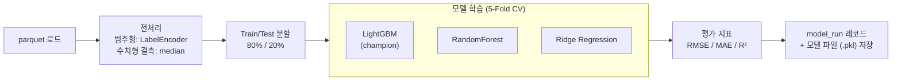

---

### 7-5. shap_simplify 서브그래프

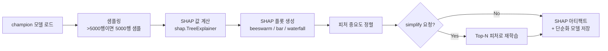

---

### 7-6. optimization 서브그래프

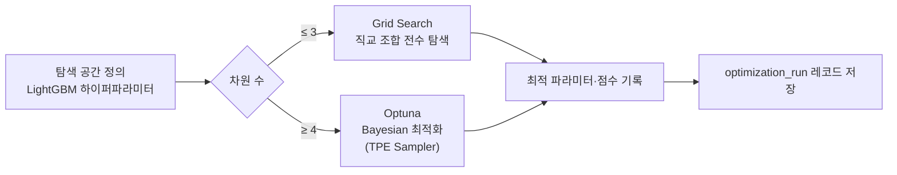

---

### 7-7. followup 서브그래프

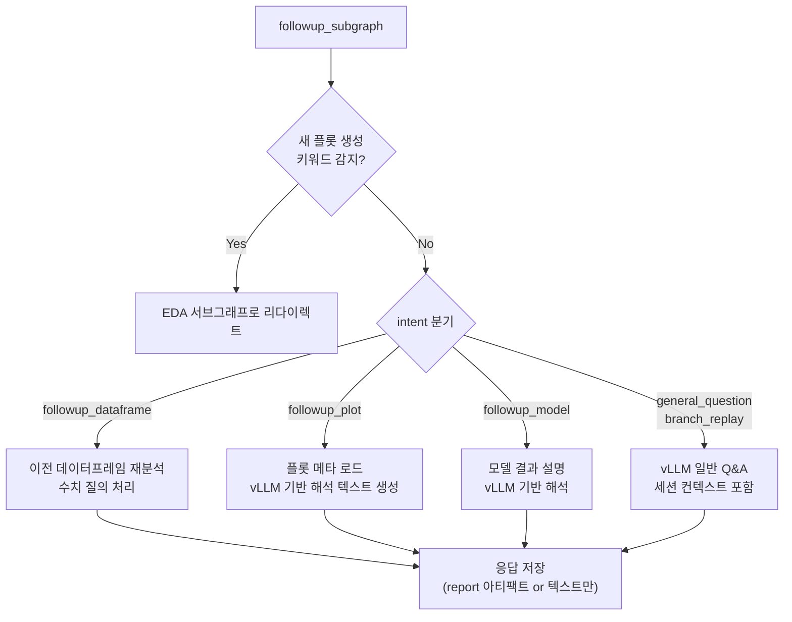

---

## 8. Worker / Job 실행 시스템

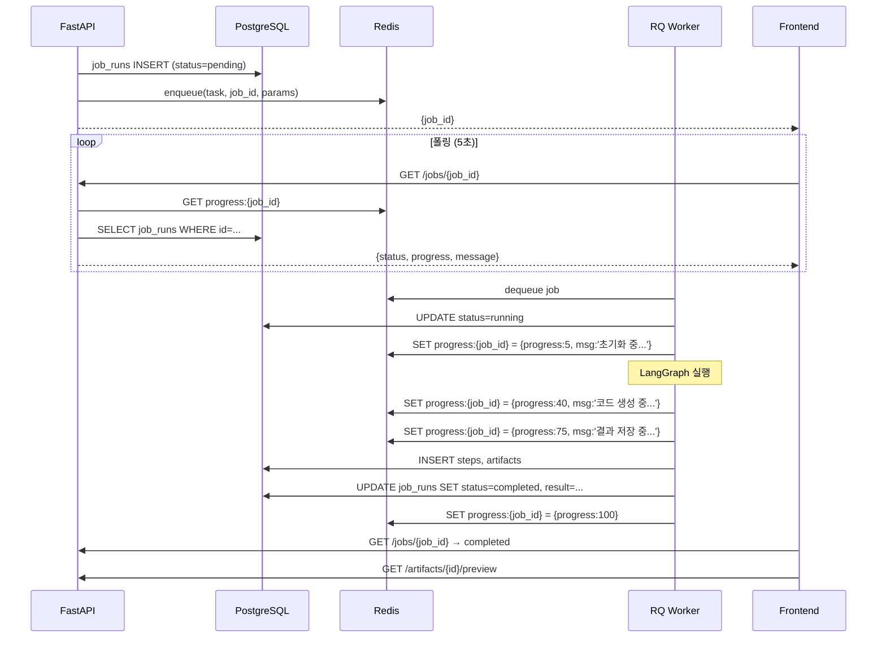

### 취소 메커니즘 (협조적 취소)

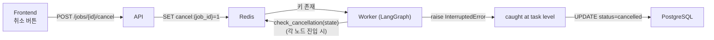

---

## 9. 데이터셋 업로드 및 파싱 파이프라인

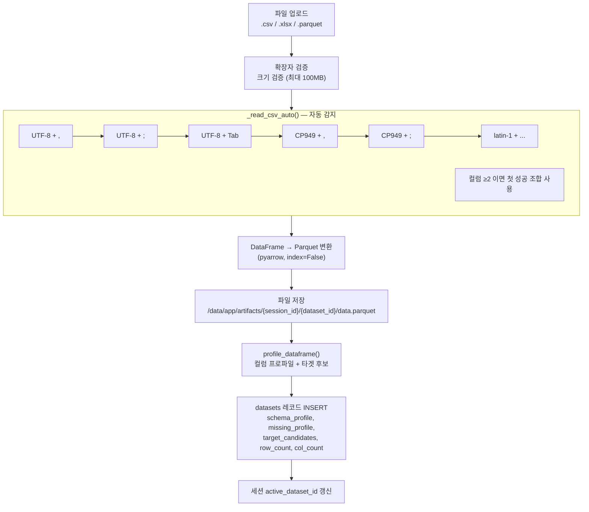

---

## 10. 아티팩트 저장 구조

### 파일시스템 레이아웃

```
/data/app/artifacts/
└── sessions/
    └── {session_id}/
        └── artifacts/
            ├── plot/                   # PNG 이미지
            │   └── eda_{step_id}_plot_1.png
            ├── dataframe/              # Parquet 데이터
            │   └── schema_summary_{step_id}.parquet
            ├── report/                 # JSON 보고서, 코드
            │   ├── target_candidates_{step_id}.json
            │   ├── profile_summary_{step_id}.json
            │   └── eda_code_{step_id}.py
            └── model/                  # 모델 파일
                └── lightgbm_{step_id}.pkl
```

### 아티팩트 타입별 처리

| `artifact_type` | mime_type | preview_json 내용 |
|-----------------|-----------|-------------------|
| `plot` | `image/png` | `{"data_url": "data:image/png;base64,..."}` |
| `dataframe` | `application/parquet` | `{"columns": [...], "rows": [...(첫 50행)]}` |
| `report` | `application/json` | JSON 내용 직접 |
| `code` | `text/x-python` | `{"code": "...(첫 5000자)", "used_fallback": bool, "error": ...}` |
| `model` | `application/octet-stream` | `{"metrics": {...}, "feature_importances": {...}}` |
| `shap` | `image/png` | base64 이미지 |

---

## 11. 데이터베이스 스키마

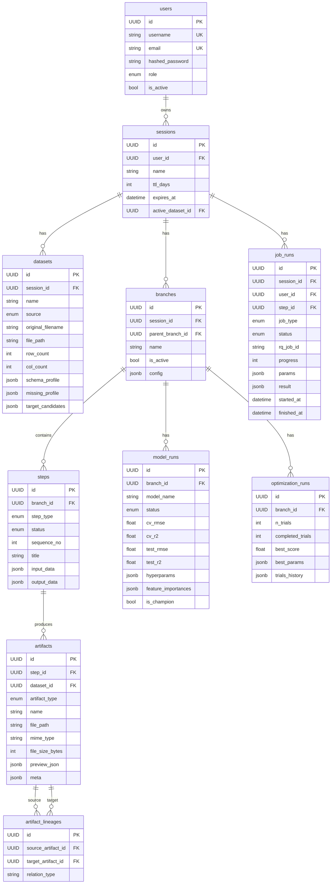

### PostgreSQL Enum 타입

```sql
-- artifact_type (Python ArtifactType 와 반드시 동기화 필요)
CREATE TYPE artifact_type AS ENUM (
    'dataframe', 'plot', 'model', 'report',
    'shap', 'feature_importance', 'leaderboard', 'code'
);
```

> ⚠️ **주의**: PostgreSQL ENUM에 새 값 추가 시 `ALTER TYPE artifact_type ADD VALUE '...'` + Python `ArtifactType` enum 클래스 양쪽 모두 수정 필요.

---

## 12. API 엔드포인트 전체 목록

| Method | Endpoint | 설명 |
|--------|----------|------|
| POST | `/auth/register` | 사용자 등록 |
| POST | `/auth/login` | JWT 로그인 |
| POST | `/auth/refresh` | 액세스 토큰 갱신 |
| POST | `/auth/logout` | 리프레시 토큰 폐기 |
| POST | `/sessions` | 세션 생성 |
| GET | `/sessions` | 세션 목록 |
| GET | `/sessions/{id}` | 세션 상세 |
| PATCH | `/sessions/{id}` | 세션 수정 |
| DELETE | `/sessions/{id}` | 세션 삭제 |
| GET | `/sessions/{id}/history` | 채팅 히스토리 + target_column 복원 |
| POST | `/sessions/{id}/datasets/upload` | CSV/XLSX/Parquet 업로드 |
| POST | `/sessions/{id}/datasets/builtin` | 내장 데이터셋 선택 |
| GET | `/sessions/{id}/datasets/builtin-list` | 내장 데이터셋 목록 |
| GET | `/sessions/{id}/datasets` | 데이터셋 목록 |
| GET | `/sessions/{id}/datasets/{did}/profile` | 컬럼 프로파일 |
| GET | `/sessions/{id}/datasets/{did}/target-candidates` | 타겟 후보 목록 |
| POST | `/sessions/{id}/branches` | 브랜치 생성 |
| GET | `/sessions/{id}/branches` | 브랜치 목록 |
| GET | `/sessions/{id}/branches/{bid}/steps` | 분석 단계 목록 |
| POST | `/analyze` | 분석 요청 (→ RQ 비동기) |
| GET | `/jobs/{job_id}` | 잡 상태 + 진행률 |
| POST | `/jobs/{job_id}/cancel` | 잡 취소 |
| GET | `/jobs/session/{session_id}/active` | 활성 잡 조회 |
| GET | `/sessions/{id}/artifacts/{aid}` | 아티팩트 메타데이터 |
| GET | `/sessions/{id}/artifacts/{aid}/preview` | 미리보기 JSON |
| GET | `/sessions/{id}/artifacts/{aid}/download` | 파일 다운로드 |
| GET | `/steps/{step_id}` | 단계 상세 |

---

## 13. 프론트엔드 아키텍처

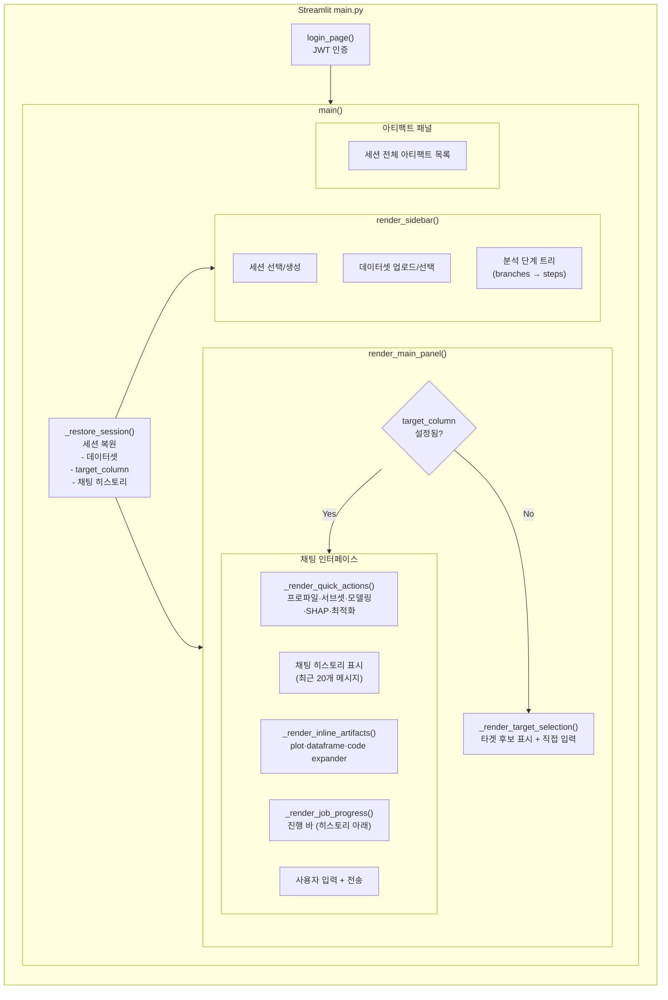

### 폴링 및 상태 관리

```python
# session_state 주요 키
st.session_state.current_session_id    # 현재 세션 UUID
st.session_state.current_dataset_id   # 현재 데이터셋 UUID
st.session_state.target_column        # 분석 목표 변수
st.session_state.active_job_id        # 진행 중인 잡 UUID
st.session_state.selected_step_id     # 선택된 분석 단계
st.session_state.selected_branch_id   # 선택된 브랜치
st.session_state.chat_histories        # {session_id: [msg, ...]}
st.session_state._restored_{sid}       # 세션 복원 완료 플래그
```

---

## 14. vLLM 연동 구조

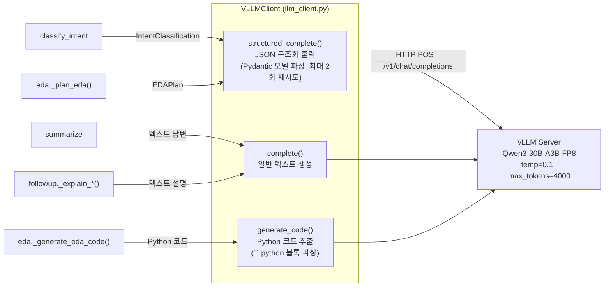

### 프롬프트 구조

| 호출 위치 | 시스템 프롬프트 | 출력 형식 |
|-----------|----------------|-----------|
| `classify_intent` | 12개 인텐트 정의 + 구분 규칙 | `IntentClassification` JSON |
| `eda._plan_eda` | EDA 계획 JSON 스키마 + 사용자 요청 | `EDAPlan` JSON |
| `eda._generate_eda_code` | 코드 규칙 + seaborn 함수 레퍼런스 | Python 코드 (plain text) |
| `followup` | 컨텍스트 (이전 단계, 플롯 메타) | 자연어 설명 |
| `summarize` | 분석 결과 요약 지시 | 자연어 응답 |

---

## 15. 코드 실행 샌드박스

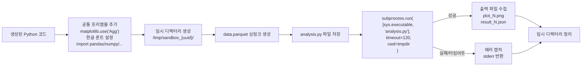

**허용 라이브러리:**
`pandas`, `numpy`, `matplotlib`, `seaborn`, `sklearn`, `scipy`, `plotly`, `statsmodels`, `xgboost`, `catboost`, `json`, `os`

**강제 적용 규칙:**
- `_fix_data_loader()`: `pd.read_csv/excel/json` → `pd.read_parquet('data.parquet')` 정규식 교체
- `pairplot` 저장 방식: `PairGrid.savefig()` (Figure가 아님)
- 모든 레이블/타이틀은 영어 사용

---

## 16. 핵심 알고리즘 요약

### CSV 자동 구분자 감지

```python
인코딩 × 구분자 조합 순서 시도:
  encodings = ["utf-8", "cp949", "latin-1"]
  separators = [",", ";", "\t", "|"]

  성공 기준: df.shape[1] >= 2 and df.shape[0] >= 1
  # 컬럼 2개 이상 = 유효한 테이블
```

### 타겟 후보 필터링 기준

```
제외 조건:
  - 수치형이 아닌 컬럼
  - unique count < 10 (분류형)
  - unique ratio > 0.95 AND 정수형 AND ID 컬럼명 (ID형)
  - missing > 50%

점수 = 완성도 × 변동성 × 유니크 보너스
```

### EDA 코드 실행 보장 전략 (2-레이어)

```
Layer 1: 프롬프트 레벨
  - plot_type enum에 pairplot/violin/kde 포함
  - user_message를 코드 생성 프롬프트에 직접 전달
  - seaborn 함수 레퍼런스 가이드 포함

Layer 2: 코드 레벨 (fallback 감지)
  - followup_plot에서 그려줘/scatter/plot 등 키워드 감지 → EDA 리다이렉트
  - 샌드박스 실패 시 _run_basic_eda() 폴백 (3개 고정 차트)
```

---

## 17. 보안 및 에러 핸들링

### 인증 흐름

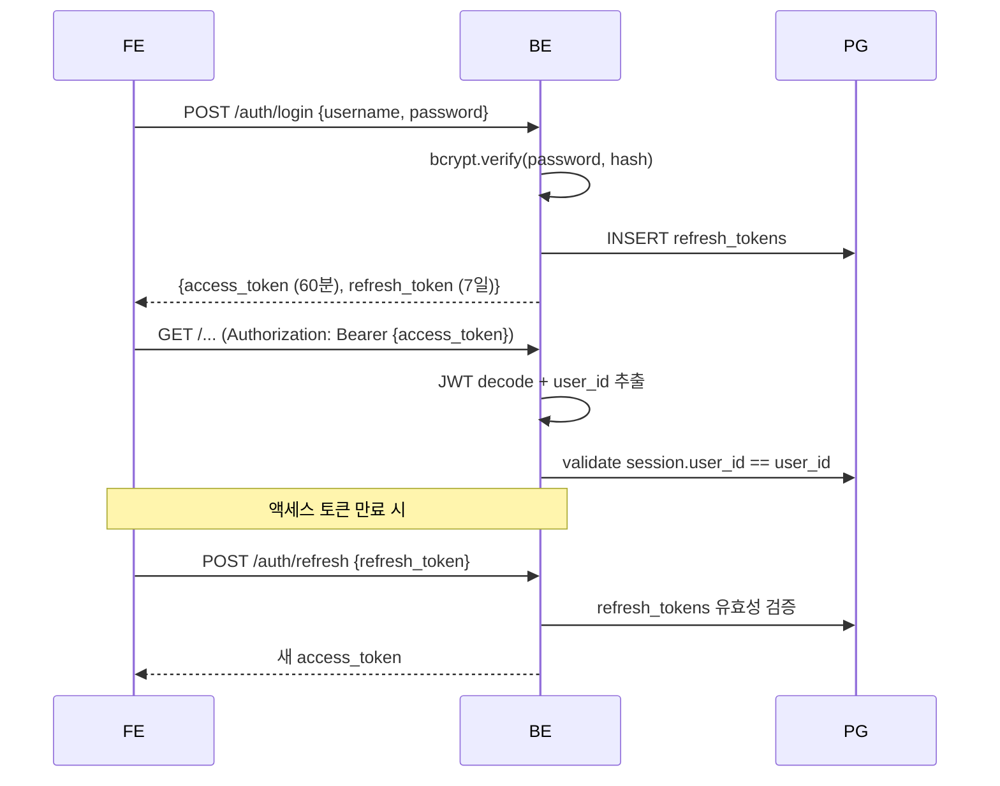

### 에러 처리 레이어

| 레이어 | 처리 방식 |
|--------|-----------|
| vLLM 호출 실패 | 2회 재시도 → 키워드 기반 폴백 |
| EDA 코드 실행 실패 | `_run_basic_eda()` 폴백 (3개 고정 차트) + 에러 메시지 저장 |
| DB 트랜잭션 실패 | rollback + 에러 로그 |
| 잡 타임아웃 (600초) | RQ timeout → status=failed |
| 파일 파싱 실패 | 다음 인코딩/구분자 조합 시도 |
| 취소 요청 | `InterruptedError` → status=cancelled |
| NaN/Inf in JSON | `_sanitize_json()` → None 치환 (PostgreSQL 호환) |

---

## 18. 알려진 한계 및 개선 포인트

### 현재 한계

| 항목 | 내용 |
|------|------|
| **LLM 코드 품질** | pairplot 등 특수 시각화 요청 시 잘못된 코드 생성 가능 (prompt engineering으로 완화 중) |
| **폴백 의존도** | EDA 코드 실패 시 항상 동일한 3개 차트 → 실패 원인 파악 어려움 |
| **단일 Worker** | 병렬 잡 처리 없음. 동시 분석 요청 시 큐 대기 |
| **vLLM 단일 엔드포인트** | LLM 서버 장애 시 모든 분석 불가 |
| **아티팩트 용량 관리** | 만료된 세션 아티팩트 자동 정리 미구현 |
| **PostgreSQL ENUM 관리** | DB와 Python 코드 수동 동기화 필요 |
| **followup 컨텍스트** | 대화 히스토리가 GraphState에 없어 이전 분석 결과 참조 제한적 |

### 개선 권고사항

1. **Worker 스케일 아웃**: `docker compose scale worker=N` 또는 Celery 전환
2. **LLM 응답 캐싱**: 동일 EDA 계획 요청 Redis 캐싱으로 속도 개선
3. **아티팩트 TTL 정리**: Cron job으로 만료 세션 파일 자동 삭제
4. **ENUM 마이그레이션 자동화**: Alembic migration에 enum 변경 포함
5. **코드 실행 보안 강화**: Docker-in-Docker 또는 gVisor 기반 격리
6. **대화 컨텍스트 강화**: 이전 N개 메시지를 GraphState에 포함 → LLM 품질 향상
7. **점진적 결과 스트리밍**: WebSocket으로 플롯 단위 실시간 전송

---

*이 문서는 `/home/dawson/project/work/Data_LG` 코드베이스를 기준으로 작성되었습니다.*
