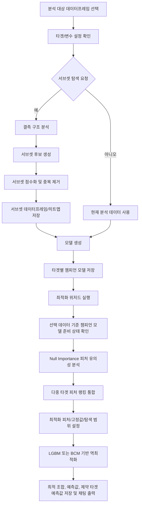

# 계산 로직 정리

이 문서는 현재 구현 기준으로 서브셋 클러스터링부터 모델 기반 최적화 위저드까지 이어지는 계산 로직을 정리한 것이다. 주요 구현 위치는 다음과 같다.

- `backend/app/graph/subgraphs/subset_discovery.py`: 결측 구조 기반 서브셋 탐색
- `backend/app/graph/subgraphs/modeling.py`: LightGBM 모델링 및 챔피언 모델 생성
- `backend/app/api/v1/routes/optimization.py`: 모델 준비 상태, Null Importance, 역최적화 API
- `backend/app/worker/inverse_optimize_tasks.py`: 피처 유의성 분석, 역최적화 실행
- `backend/app/worker/bcm_model.py`: BCM 모델 계산
- `frontend-react/src/components/optimization/InverseOptimizationModal.tsx`: 최적화 위저드 단계 및 사용자 입력 흐름

## 전체 흐름



## 1. 분석 대상 데이터프레임과 설정 상속

최적화 위저드는 임의의 데이터프레임 전체를 대상으로 동작하지 않는다. 현재 선택된 기본 데이터셋 또는 분석 데이터 아티팩트 중에서 타겟 컬럼과 변수 컬럼 설정이 모두 완료된 데이터프레임만 후보로 사용한다.

데이터 기준은 다음 순서로 결정된다.

1. 위저드에서 명시적으로 선택한 서브셋 또는 분석 데이터프레임
2. 현재 분석 대상 데이터프레임
3. 현재 세션의 기본 데이터셋

서브셋 또는 신규 분석 데이터프레임이 만들어질 때는 원본 데이터프레임의 타겟/변수 설정을 상속한다. 단, 데이터 핸들링 과정에서 제거된 컬럼은 새 데이터프레임 설정에서 제외되어야 하며, 제거된 변수는 사용자에게 안내된다.

## 2. 서브셋 클러스터링

현재 서브셋 탐색은 엄밀한 의미의 K-Means 같은 거리 기반 클러스터링이 아니라, 결측 구조와 저카디널리티 층화를 이용한 규칙 기반 dense subset discovery이다. 목적은 전체 데이터 중에서 결측 패턴이 비슷하거나 관측 밀도가 높은 부분 데이터프레임 후보를 찾는 것이다.

### 2.1 입력 컬럼 제한

서브셋 탐색 요청에 `feature_columns`가 있으면 원본 데이터에서 다음 컬럼만 남긴다.

```text
사용자 설정 변수 컬럼 + 사용자 설정 타겟 컬럼
```

따라서 타겟이 2개 이상이면 서브셋 데이터프레임은 각 타겟별로 나뉘는 것이 아니라, 설정된 모든 타겟과 모든 설정 변수를 함께 포함해야 한다.

### 2.2 컬럼 분류

각 컬럼은 다음 기준으로 분류된다.

| 분류 | 기준 |
|---|---|
| `target` | 사용자가 지정한 타겟 컬럼 |
| `high_missing` | 결측률 `> 0.8` |
| `constant` | 고유값 수 `<= 1` |
| `near_constant` | 고유값 비율 `< 0.005` |
| `id_like` | 고유값 비율 `> 0.95` 이고 비수치형 |
| `low_cardinality` | object/category 타입이고 고유값 수 `< 20` |
| `numeric` | 일반 수치형 |
| `categorical` | 일반 비수치형 |

분석 대상 결측 구조에서는 `constant`, `near_constant`, `id_like` 컬럼을 제외한다. 서브셋 후보 생성에서는 여기에 `high_missing` 컬럼도 제외한다.

### 2.3 결측 구조 분석

행별로 어떤 컬럼이 결측인지 집합을 만든 뒤, 동일한 결측 컬럼 집합을 하나의 행 결측 서명으로 본다.

```text
row_signature(row) = sorted(결측 컬럼 목록)
```

계산 결과로 다음을 만든다.

| 항목 | 설명 |
|---|---|
| `row_signatures` | 빈도가 높은 상위 10개 행 결측 패턴 |
| `co_missing_pairs` | 동시에 결측인 컬럼쌍 상위 20개 |
| `analysis_cols` | 결측 구조 분석에 사용된 컬럼 목록 |

공동 결측 분석은 결측이 있는 컬럼 중 앞쪽 15개까지만 조합하여 계산한다. 이는 큰 데이터에서 컬럼쌍 폭증을 막기 위한 제한이다.

### 2.4 서브셋 후보 생성 전략

서브셋 후보는 네 가지 전략으로 생성된다.

| 전략 | 조건 | 결과 |
|---|---|---|
| 행 결측 서명 그룹 | 상위 5개 결측 서명, 동일 결측 패턴 행 수 `>= 10` | 해당 결측 패턴에서 결측이 아닌 컬럼 + 타겟 |
| 저카디널리티 층화 | 저카디널리티 컬럼 상위 3개, 각 컬럼의 빈도 상위 3개 값, 행 수 `>= 20` | 해당 그룹에서 결측률 `< 0.5`인 컬럼 + 타겟 |
| 하이브리드 밀집 규칙 | 행 결측률 `<= 0.3/0.5/0.7`, 열 결측률 `<= 0.2/0.4`, 행 수 `>= 20`, 컬럼 수 `>= 3` | 관측 밀도가 높은 행/열 조합 + 타겟 |
| 완전 행 서브셋 | 사용 가능 컬럼 전체가 non-null인 행 수 `>= 20` | 완전 행 + 사용 가능 컬럼 + 타겟 |

후보 생성 직후 1차 중복 제거를 수행한다. 두 후보의 행 겹침 비율이 `0.9`를 초과하고 컬럼 집합이 같으면 중복으로 보고 하나만 유지한다.

```text
row_similarity = overlap_rows / min(n_rows_a, n_rows_b)
중복 조건 = row_similarity > 0.9 AND set(cols_a) == set(cols_b)
```

### 2.5 서브셋 점수

각 후보의 점수는 다음 수식으로 계산된다.

```text
score = row_coverage
      * feature_coverage
      * (1 - mean_missingness)
      * target_completeness
```

각 항목은 다음과 같다.

| 항목 | 정의 |
|---|---|
| `row_coverage` | 후보 행 수 / 전체 행 수 |
| `feature_coverage` | 후보 컬럼 수 / 전체 컬럼 수 |
| `mean_missingness` | 후보 행과 후보 피처 컬럼에서의 평균 결측률 |
| `target_completeness` | 후보 행에서 타겟 컬럼이 non-null인 비율의 평균 |

점수는 높을수록 좋다. 즉, 많은 행과 컬럼을 포함하면서 결측이 적고 타겟 값이 잘 채워진 후보가 우선된다.

### 2.6 전체 데이터와 유사한 후보 제거

다음 조건을 동시에 만족하면 사실상 전체 데이터와 다르지 않은 후보로 보고 제거한다.

```text
row_coverage >= 0.95 AND feature_coverage >= 0.95
```

모든 후보가 제거되면 별도 서브셋 없이 전체 데이터 그대로 모델링하는 것을 권장한다.

### 2.7 최종 선택과 동일 컬럼 조합 제거

기본 선택 개수는 `settings.default_subset_limit = 5`이다. 최종 선택 전에 동일한 컬럼 조합을 가진 후보는 하나로 축약한다.

```text
column_signature = sorted(cols)
```

동일한 `column_signature`가 여러 개 있으면 점수 정렬상 가장 앞에 있는 후보, 즉 가장 높은 점수의 후보만 유지한다. 이유는 사용자 관점에서 동일한 컬럼 조합의 데이터프레임은 사실상 같은 분석 단위로 보이기 때문이다.

### 2.8 서브셋 결과 아티팩트

서브셋 탐색은 다음 아티팩트를 저장한다.

| 아티팩트 | 설명 |
|---|---|
| `subset_nullity_heatmap` | 각 서브셋의 결측/관측/서브셋 셀을 보여주는 히트맵 |
| 컬럼 분류 테이블 | 컬럼별 분류 결과 |
| 결측 구조 리포트 | 행 결측 서명, 공동 결측쌍 |
| `subset_registry` | 최종 서브셋 목록과 메타데이터 |
| `subset_score_table` | 서브셋별 점수표 |
| `subset_N_df` | 실제 서브셋 데이터프레임 |
| `subset_summary` | 요약 리포트 |

Nullity heatmap의 색상 의미는 다음과 같다.

| 색상 | 의미 |
|---|---|
| 흰색 | 전체 데이터에서 결측 |
| 회색 | 전체 데이터에서 값이 있음 |
| 검정 | 해당 서브셋에 포함되는 셀 |

행이 너무 많으면 최대 900행까지만 표시한다. 이때 서브셋 행을 우선 포함하고, 남는 공간에 비서브셋 행을 샘플링한다.

## 3. 모델 생성과 챔피언 모델

모델 생성은 현재 선택 데이터프레임과 타겟별로 수행된다. 타겟이 여러 개이면 각 타겟에 대해 독립적으로 모델링이 실행된다.

### 3.1 타겟 검증

모델링 전에 타겟 컬럼은 다음 조건을 통과해야 한다.

| 조건 | 실패 시 의미 |
|---|---|
| 타겟 컬럼이 데이터프레임에 존재 | 잘못된 타겟 |
| 타겟의 non-null 값이 수치형 | 비수치 타겟 |
| 타겟 고유값 수 `> 1` | 상수 타겟 |
| 타겟 non-null 행 기준 훈련 행 수 `>= 20` | 훈련 데이터 부족 |

### 3.2 피처 매트릭스 구성

피처 후보는 사용자 설정 변수 컬럼이 있으면 해당 컬럼으로 제한한다. 설정 변수 컬럼이 없거나 모두 유효하지 않으면 타겟을 제외한 전체 컬럼으로 폴백한다.

피처 제외 기준은 다음과 같다.

| 제외 대상 | 기준 |
|---|---|
| 상수 컬럼 | 고유값 수 `<= 1` |
| ID형 비수치 컬럼 | 고유값 비율 `> 0.95` 이고 비수치형 |

object 타입 컬럼은 결측을 `"__missing__"`으로 채운 뒤 category dtype으로 바꾼다. 기존 category 타입도 결측이 있으면 `"__missing__"` 카테고리를 추가해 채운다.

### 3.3 LightGBM 학습

현재 기본 모델은 LightGBM 회귀 모델이다.

| 항목 | 값 |
|---|---|
| 목적 함수 | `regression` |
| 평가 metric | `rmse`, `mae` |
| `num_leaves` | 31 |
| `learning_rate` | 0.05 |
| `feature_fraction` | 0.9 |
| `bagging_fraction` | 0.8 |
| `bagging_freq` | 5 |
| `num_boost_round` | 200 |
| `early_stopping_rounds` | 30 |
| train/validation split | 80/20 |
| random seed | 42 |

평가 지표는 train/validation 각각에 대해 RMSE, MAE, MAPE, R2를 계산한다. 피처 중요도는 LightGBM gain importance로 저장한다.

### 3.4 챔피언 모델 선택

한 번의 모델링 실행에서 만들어진 모델 중 validation RMSE가 가장 낮은 모델이 챔피언이다.

```text
champion = argmin(validation_RMSE)
```

챔피언 모델은 논리적으로 다음 단위에 종속된다.

```text
브랜치 + 기준 데이터셋/아티팩트 + 타겟 컬럼
```

따라서 같은 타겟이라도 기본 데이터셋에서 만든 챔피언과 특정 서브셋에서 만든 챔피언은 서로 다른 모델로 취급된다. 최적화 위저드는 현재 선택 데이터 기준의 챔피언 모델이 있는지 확인한다.

### 3.5 다중 타겟 모델링 실패 처리

다중 타겟 요청에서는 각 타겟을 독립적으로 모델링한다. 일부 타겟이 훈련 불가능하더라도 가능한 타겟은 계속 학습한다.

| 상황 | 처리 |
|---|---|
| 일부 타겟 성공, 일부 실패 | 작업은 완료 처리하고 실패 타겟과 사유를 메시지에 포함 |
| 모든 타겟 실패 | 작업 실패 처리 |

## 4. 최적화 위저드의 데이터 및 모델 준비 상태

최적화 위저드의 첫 단계는 타겟/변수 설정이 완료된 데이터프레임을 고르는 단계이다. 선택 가능한 후보는 다음 조건을 만족해야 한다.

```text
targetColumns.length > 0 AND featureColumns.length > 0
```

서브셋 또는 분석 데이터프레임 아티팩트는 dataframe 타입이어야 하며, `subset_N_df`, `create_dataframe`, `create_dataframe_result` 또는 이름상 서브 데이터셋으로 판별되는 경우 후보가 된다. 기본 데이터셋도 현재 분석 대상이고 설정이 완료되어 있으면 후보가 된다.

모델 준비 상태는 타겟별로 확인한다.

```text
get_champion_by_target(branch_id, target, desired_dataset_path, source_artifact_id)
```

판정 결과는 다음 중 하나이다.

| 상태 | 의미 |
|---|---|
| `ready` | 현재 선택 데이터 기준 챔피언 모델이 존재 |
| `missing_champion` | 해당 타겟 챔피언 모델이 없음 |
| `dataset_mismatch` | 챔피언은 있으나 현재 선택 데이터 기준이 아님 |

모든 선택 타겟의 챔피언 모델이 준비되어야 Null Importance와 최적화를 안정적으로 수행할 수 있다.

## 5. 피처 유의성 분석: Null Importance

피처 유의성 분석은 챔피언 모델 기반으로 수행된다. 단순 상관계수가 아니라, 모델 예측에 대한 SHAP 중요도와 타겟 무작위 순열의 null distribution을 비교한다.

### 5.1 타겟별 분석 입력

각 타겟에 대해 다음 정보를 사용한다.

| 항목 | 설명 |
|---|---|
| `model_path` | 타겟별 챔피언 모델 파일 |
| `feature_names` | 모델 학습 피처 |
| `dataset_path` | 모델이 학습된 기준 데이터 |
| `target_column` | 분석 타겟 |
| `categorical_features` | 범주형 피처 목록 |
| `categorical_encoders` | 저장된 범주형 인코더 |
| `model_kind` | `lgbm_model` 또는 `baseline_model` |

전처리는 모델 종류에 따라 달라진다.

| 모델 종류 | 범주형 처리 |
|---|---|
| `lgbm_model` | category dtype 유지 |
| `baseline_model` | 저장 인코더 또는 정렬 기반 fallback mapping으로 숫자 인코딩 |

수치형 결측은 중앙값으로 채운다. 중앙값 계산이 불가능하면 0으로 채운다.

### 5.2 실제 중요도 계산

타겟별로 학습 모델을 로드하고, 모델 피처 중 데이터셋에 존재하는 컬럼만 사용한다. SHAP 계산 대상은 최대 3000행으로 제한한다.

```text
actual_importance(feature) = mean(abs(SHAP_value(feature)))
```

### 5.3 Null Importance 계산

타겟 값을 무작위로 섞은 뒤, 같은 피처로 작은 LightGBM 회귀 모델을 반복 학습한다.

| 항목 | 값 |
|---|---|
| 기본 반복 횟수 | 30 |
| null model | `LGBMRegressor` |
| `num_leaves` | 31 |
| `learning_rate` | 0.1 |
| `n_estimators` | 50 |
| random seed | 42 |

각 반복에서 SHAP 중요도를 계산하고 피처별 null distribution을 만든다.

```text
null_importance(feature) = {
  p5, p50, p90, p95
}
```

유의 피처 판정 기준은 다음과 같다.

```text
significant(feature) = actual_importance(feature) > null_importance(feature).p90
```

단일 타겟에서 추천 피처는 유의 피처를 실제 중요도 내림차순으로 정렬한 목록이다. 유의 피처가 3개 미만이면 실제 중요도 상위 피처로 보충하고, 최대 15개까지 추천한다.

## 6. 다중 타겟 피처 랭킹 통합

타겟이 2개 이상이면 Null Importance를 타겟별로 반복 수행한 뒤, 여러 타겟을 함께 설명할 수 있는 합집합 피처 랭킹을 만든다. 현재 알고리즘 이름은 `coverage_weighted_union_v1`이다.

### 6.1 타겟별 피처 점수

각 타겟에서 피처별 실제 중요도와 null p90을 가져온다.

```text
normalized = actual / max_actual_importance_of_target
margin = max(actual - p90, 0)
relative_margin = margin / max(actual, p90, 1e-9)
target_score = 0.65 * normalized + 0.35 * relative_margin
```

의미는 다음과 같다.

| 항목 | 의미 |
|---|---|
| `normalized` | 해당 타겟 내부에서 상대적으로 얼마나 중요한가 |
| `relative_margin` | null 분포 p90을 얼마나 안정적으로 초과하는가 |
| `target_score` | 타겟 하나에 대한 피처 설명력 점수 |

### 6.2 커버리지 기반 종합 점수

피처가 유의한 타겟 수를 계산한다.

```text
coverage_count = 유의한 타겟 수
coverage_ratio = coverage_count / 전체 타겟 수
mean_target_score = 평균 target_score
aggregate_score = 0.55 * coverage_ratio + 0.45 * mean_target_score
```

종합 점수는 모든 타겟을 동시에 설명하는 피처를 우선한다. 즉, 한 타겟에서만 매우 강한 피처보다 여러 타겟에서 유의하게 작동하는 피처가 더 높은 순위를 받을 수 있다.

정렬 기준은 다음 순서이다.

```text
1. coverage_count 내림차순
2. aggregate_score 내림차순
3. feature name 오름차순
```

추천 피처는 다음 순서로 구성된다.

```text
full_coverage features
→ partial_coverage features
→ no_coverage features
```

최대 15개까지 추천하며, 최소 3개를 확보하려고 한다. 추천 개수 `recommended_n`은 다음 기준으로 정한다.

```text
recommended_n = min(
  len(recommended_features),
  max(3, min(15, len(full_coverage) + max(1, target_count)))
)
```

## 7. 최적화 피처 설정

Null Importance가 완료되면 위저드는 추천 피처를 기반으로 최적화 대상 피처 후보를 만든다.

```text
allowedFeatures = recommended_features ∩ 사용자 설정 변수 컬럼
candidateFeatures = allowedFeatures 상위 nFeat개
finalFeatures = candidateFeatures ∩ 선택 서브셋 컬럼
```

사용자는 다음 값을 조정할 수 있다.

| 설정 | 의미 |
|---|---|
| `nFeat` | 최적화에 사용할 상위 피처 개수 |
| 고정 피처 | 최적화하지 않고 특정 값으로 고정할 피처 |
| `expandRatio` | 데이터 기반 탐색 범위를 바깥으로 확장하는 비율 |
| 모델 타입 | `lgbm` 또는 `bcm` |
| 최적화 타겟 | maximize/minimize 대상 타겟 |
| 제약 조건 | 나머지 타겟에 대한 `>=` 또는 `<=` threshold |

타겟이 3개 이상이면 하나를 최적화 대상으로 선택하고, 나머지 타겟 중 여러 개를 제약 조건으로 둘 수 있다. 제약 조건은 각각 독립적인 챔피언 모델을 사용한다.

## 8. 역최적화 계산

최적화는 `scipy.optimize.differential_evolution`으로 수행한다. 위저드는 제약 조건이 없더라도 확장 가능한 경로인 `constrained-inverse-run`을 사용한다.

### 8.1 기준 벡터

최적화 시작점 역할을 하는 `base_row`는 학습 데이터의 대표값으로 만든다.

| 컬럼 타입 | 기준값 |
|---|---|
| 수치형 | 중앙값 |
| 비수치형 | 최빈값 |
| 모델에는 필요하지만 데이터에 없는 피처 | 0 |
| 사용자가 고정한 피처 | 사용자 입력값으로 덮어씀 |

### 8.2 탐색 범위

최적화 대상 피처는 범주형을 제외한 수치형 피처이다. 각 피처의 범위는 다음 순서로 결정된다.

1. Null Importance 결과의 `feature_ranges`
2. 기준 데이터에서의 실제 min/max
3. 둘 다 불가능하면 `[0, 1]`

확장 비율을 적용한 실제 탐색 범위는 다음과 같다.

```text
spread = (hi - lo) * expand_ratio
bound = [lo - spread, hi + spread]
```

### 8.3 목적 함수

최적화 방향에 따라 부호를 바꾼다.

```text
sign = -1 if direction == "maximize" else 1
```

제약 조건이 없으면 목적 함수는 다음과 같다.

```text
objective(x) = sign * primary_prediction(x)
```

제약 조건이 있으면 위반량에 큰 패널티를 더한다.

```text
objective(x) = sign * primary_prediction(x)
             + constraint_penalty * total_violation(x)
```

기본 `constraint_penalty`는 `1e6`이다.

제약 위반량은 조건 타입에 따라 다르다.

```text
gte 조건: violation = max(0, threshold - constraint_prediction)
lte 조건: violation = max(0, constraint_prediction - threshold)
```

제약 모델 예측 자체가 실패하면 고정 패널티 `1e6`을 추가한다.

### 8.4 Differential Evolution 설정

| 항목 | 값 |
|---|---|
| `popsize` | 12 |
| `maxiter` | `max(10, n_calls // (popsize * n_bounds))` |
| `seed` | 42 |
| `tol` | `1e-6` |
| `workers` | 1 |

평가 횟수는 내부 objective 호출 수로 기록된다.

### 8.5 결과 계산

최적화가 끝나면 다음을 계산한다.

| 결과 | 의미 |
|---|---|
| `optimal_features` | 최적점에서의 선택 피처 값 |
| `baseline_features` | 기준 벡터에서의 선택 피처 값 |
| `optimal_prediction` | 최적점의 최적화 타겟 예측값 |
| `baseline_prediction` | 기준 벡터의 최적화 타겟 예측값 |
| `improvement` | `optimal_prediction - baseline_prediction` |
| `constraints` | 최적점에서 각 제약 타겟의 예측값 |
| `convergence` | scipy 최적화 성공 여부 |

제약 조건으로만 사용한 타겟도 최적점에서의 예측값을 결과에 포함한다.

## 9. BCM 최적화

BCM은 기존 LightGBM 챔피언 모델에 두 개의 Gaussian Process expert를 결합한 예측 모델이다.

```text
BCM = 0.5 * BCM(GPR_RBF, GPR_Linear) + 0.5 * LGBM
```

### 9.1 GPR 학습 피처

GPR은 선택된 최적화 피처 중 범주형이 아닌 피처를 우선 사용한다. 지정 피처가 없으면 전체 수치형 비범주 피처를 사용한다.

### 9.2 GPR 행 샘플링

GPR은 계산량이 대략 `O(N^3)`이므로 학습 행 수를 동적으로 제한한다.

```text
ref_capacity = (500^3) * 5 * 1.5
dynamic_max_rows = int((ref_capacity / n_features)^(1/3))
dynamic_max_rows = clamp(dynamic_max_rows, 200, 1000)
```

전체 행 수가 `dynamic_max_rows`를 넘으면 무작위 샘플링한다.

### 9.3 GPR expert

두 개의 expert를 학습한다.

| Expert | Kernel |
|---|---|
| RBF GPR | `RBF(length_scale=1, bounds=1e-2~1e2) + WhiteKernel` |
| Linear GPR | `DotProduct(sigma_0=1.0, bounds=1e-3~1e3) + WhiteKernel` |

둘 다 `normalize_y=True`, `alpha=1e-6`, optimizer restart는 0으로 설정한다.

### 9.4 BCM 예측 수식

두 GPR expert의 평균과 표준편차를 각각 `mu1, std1`, `mu2, std2`라고 할 때,

```text
var1 = std1^2 + 1e-10
var2 = std2^2 + 1e-10
prior_var = var(y) + 1e-6
M = 2

inv_var_bcm = 1/var1 + 1/var2 + (1 - M)/prior_var
inv_var_bcm = max(inv_var_bcm, 1e-10)

var_bcm = 1 / inv_var_bcm
mu_bcm = var_bcm * (mu1/var1 + mu2/var2)

final_prediction = 0.5 * mu_bcm + 0.5 * mu_lgbm
```

BCM은 LightGBM 예측과 GPR committee 예측을 50:50으로 블렌딩한다. 따라서 최적화 목표 함수에서 `model_type = "bcm"`이면 위 최종 예측값이 `primary_prediction`으로 사용된다.

## 10. 결과 저장 및 채팅 출력

Null Importance와 역최적화 결과는 모두 report 아티팩트로 저장된다. 작업 완료 시 결과 아티팩트 ID가 채팅 메시지에 첨부된다.

채팅 영역은 report 아티팩트의 raw preview JSON을 보고 다음 포맷을 렌더링한다.

| 결과 종류 | 표시 내용 |
|---|---|
| 피처 유의성 분석 | 추천 피처, 종합 점수, 커버리지, 유의 타겟 테이블 |
| 역최적화 | 최적 예측값, 기준 예측값, 개선량, 제약 예측값, 피처별 기준값/최적값/변화량 테이블 |

따라서 위저드 내부 결과와 채팅 패널 결과는 동일한 계산 결과를 다른 위치에서 표시하는 구조이다.

## 11. 주요 실패 조건

| 단계 | 대표 실패 조건 | 메시지 방향 |
|---|---|---|
| 서브셋 탐색 | 의미 있는 후보 없음 | 전체 데이터 모델링 권장 |
| 모델링 | 타겟 없음, 비수치 타겟, 상수 타겟, 훈련 행 부족 | 타겟별 실패 사유 표시 |
| 모델 준비 상태 | 현재 선택 데이터 기준 챔피언 없음 | 모델 생성 먼저 실행 |
| Null Importance | 선택 타겟 중 챔피언 없음 | 누락 타겟명 표시 |
| Null Importance | 모델 피처가 데이터에 없음 | 해당 타겟 분석 실패 |
| 최적화 | 선택 피처 중 수치형 피처 없음 | 최적화 실행 불가 |
| 최적화 | 제약 모델 예측 실패 | 패널티 부여, 가능한 경우 계속 탐색 |

## 12. 해석상 주의점

서브셋 탐색 점수는 모델 성능 점수가 아니다. 결측이 적고 타겟이 잘 채워진 분석 가능한 데이터프레임 후보를 찾기 위한 밀도 점수이다.

피처 유의성 분석의 종합 점수는 예측 성능 자체가 아니라, SHAP 실제 중요도가 null distribution을 얼마나 안정적으로 초과하는지와 여러 타겟을 얼마나 넓게 커버하는지를 결합한 랭킹 점수이다.

역최적화 결과는 모델이 학습한 데이터 분포와 피처 범위 안팎에서의 예측 기반 추천이다. `expandRatio`가 커질수록 실제 데이터 분포 밖의 조합을 탐색할 수 있으므로, 결과는 실험 가능성 및 도메인 제약과 함께 검토해야 한다.
